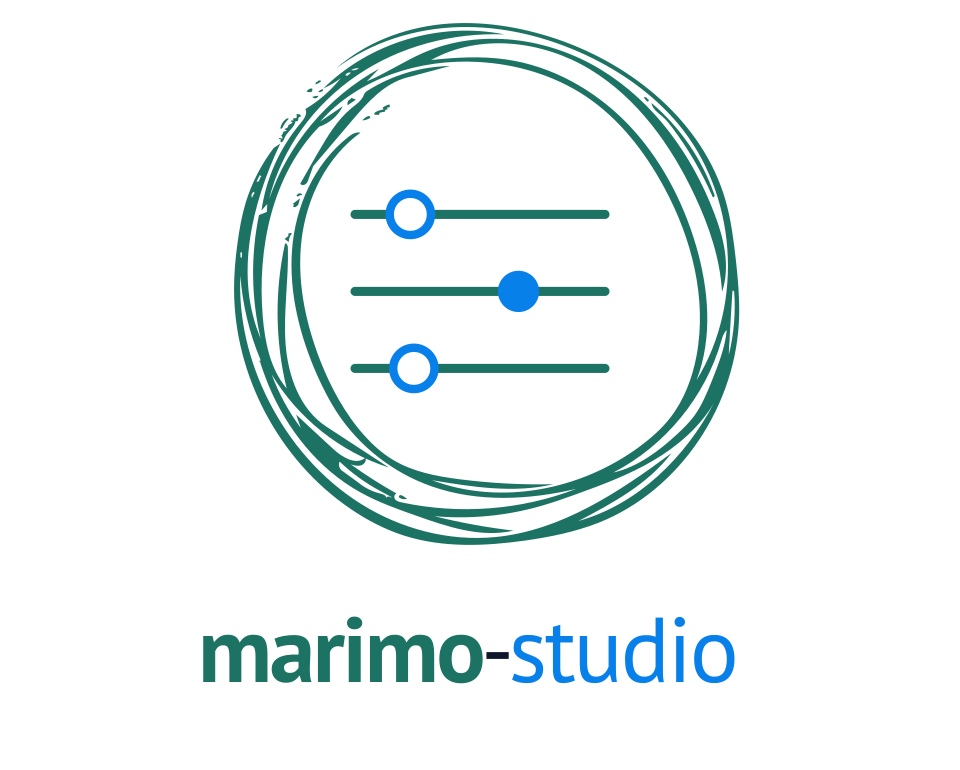
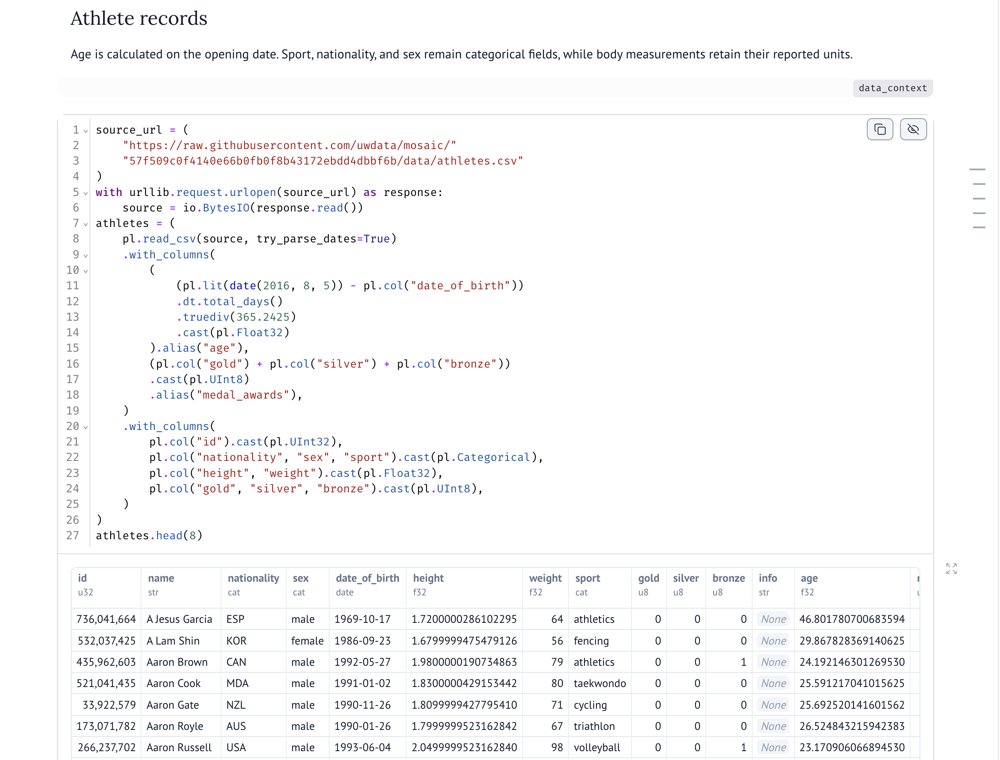
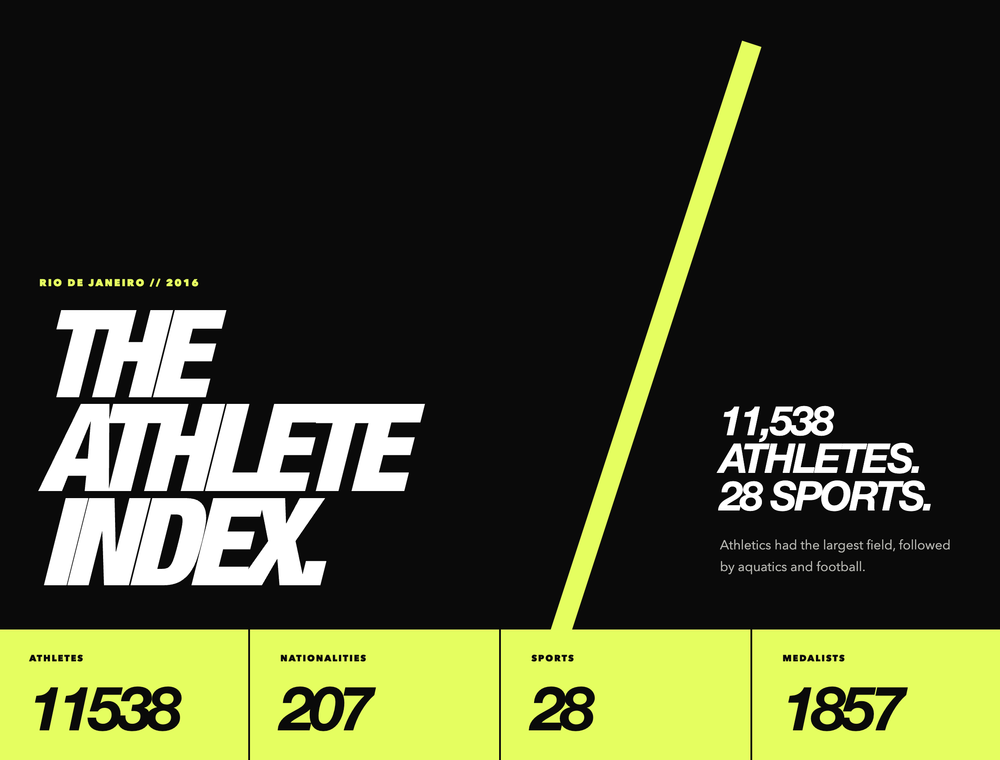
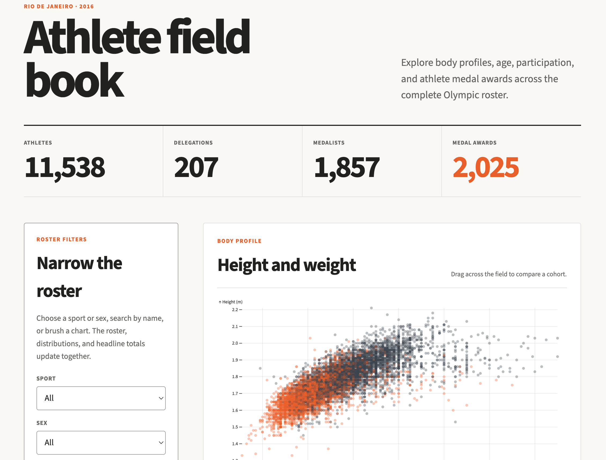
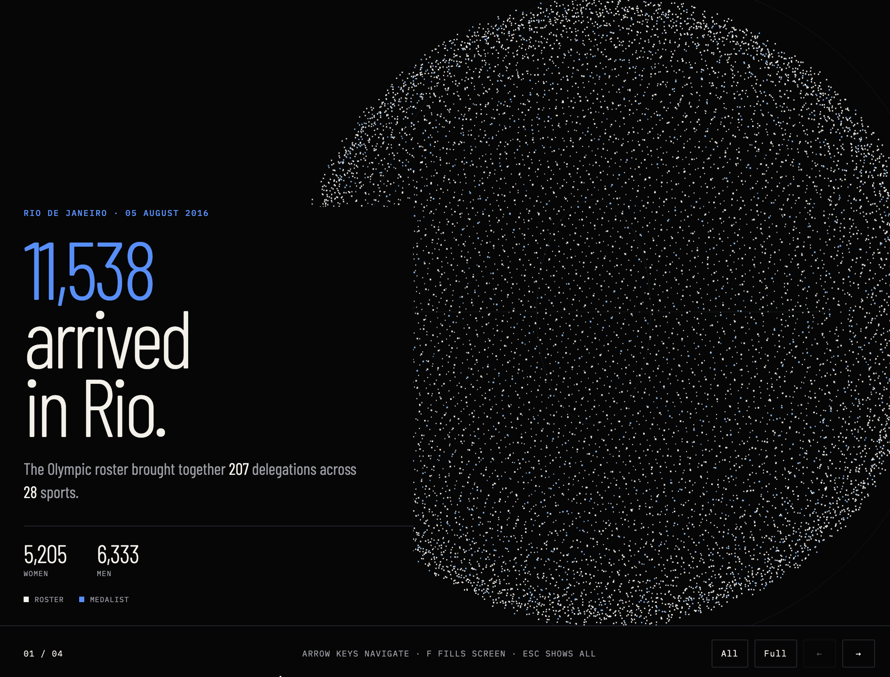
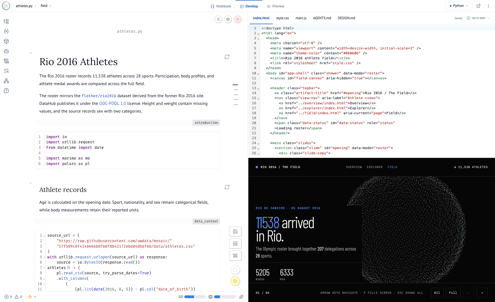

<p align="center">
  <a href="https://marimo-team.github.io/marimo-studio/">
    <picture>
      <source media="(prefers-color-scheme: dark)" srcset="apps/docs/public/brand/marimo-studio-lockup-stacked-dark.svg">
      
    </picture>
  </a>
</p>

<p align="center">
  <a href="https://github.com/marimo-team/marimo-studio/actions/workflows/ci.yml"></a>
  <a href="https://pypi.org/project/marimo-studio/"></a>
  <a href="https://pypi.org/project/marimo-studio/"></a>
</p>

Marimo Studio lets you build multiple custom web views from one
[marimo](https://marimo.io/) notebook, using modern web tools and coding agents.

> **Experimental:** Marimo Studio is changing rapidly.

## Examples

An ordinary notebook supplies the data and calculations for three views,
each with its own frontend and interaction model.

### [Notebook](https://marimo-team.github.io/marimo-studio/examples/athletes/notebook/index.html)

[`marimo`](https://github.com/marimo-team/marimo) ·
[`Python`](https://github.com/python/cpython) ·
[`Polars`](https://github.com/pola-rs/polars)

Load the Rio roster, derive age and medal counts, and inspect the data used by
every view.

[](https://marimo-team.github.io/marimo-studio/examples/athletes/notebook/index.html)

### [Publication report](https://marimo-team.github.io/marimo-studio/examples/athletes/overview/index.html)

[`Vanilla HTML`](https://github.com/whatwg/html)

A high-contrast summary of 11,538 athletes, 207 delegations, 28 sports, and
1,857 medalists.

[](https://marimo-team.github.io/marimo-studio/examples/athletes/overview/index.html)

### [Linked explorer](https://marimo-team.github.io/marimo-studio/examples/athletes/explorer/index.html)

[`Svelte`](https://github.com/sveltejs/svelte) ·
[`Mosaic`](https://github.com/uwdata/mosaic)

Filter athletes by sport or sex, search by name, and brush charts to update the
roster, distributions, and totals together.

[](https://marimo-team.github.io/marimo-studio/examples/athletes/explorer/index.html)

### [Interactive briefing](https://marimo-team.github.io/marimo-studio/examples/athletes/field/index.html)

[`Vanilla HTML`](https://github.com/whatwg/html) ·
[`Shower`](https://github.com/shower/shower) ·
[`Three.js`](https://github.com/mrdoob/three.js)

Move through the roster, sports, medalists, and body profiles in a four-chapter
presentation built from one point per athlete.

[](https://marimo-team.github.io/marimo-studio/examples/athletes/field/index.html)

[Explore the notebook and all three live views.](https://marimo-team.github.io/marimo-studio/examples/athletes)

## Quickstart

Start with a saved notebook such as `analysis.py`:

```console
uvx --from marimo-studio==0.1.0 marimo-studio view create dashboard --target analysis.py
uvx --with marimo-studio==0.1.0 marimo edit analysis.py --sandbox
```

The first command creates the view source beside the notebook. The second opens
marimo with three connected surfaces:

- **Notebook** for Python and reactive computation
- **Source** for the view's HTML, styles, and browser code
- **Preview** for the rendered view

Choose **Develop** to see all three. Saving Source rebuilds Preview, while a
failed build leaves the last successful view available.



Studio calls each named frontend project a **view**. Add another view when the
same analysis needs a different layout, explanation, or interaction for another
purpose.

## Documentation

Read the [documentation](https://marimo-team.github.io/marimo-studio/) for
frontend options, notebook results, agent authoring, and deployment. Use
[troubleshooting](https://marimo-team.github.io/marimo-studio/guide/troubleshooting)
or [open an issue](https://github.com/marimo-team/marimo-studio/issues) when
something goes wrong. See [Security](SECURITY.md) and
[Contributing](CONTRIBUTING.md) for project policies.

## License

Marimo Studio is licensed under the [Apache License 2.0](LICENSE).
