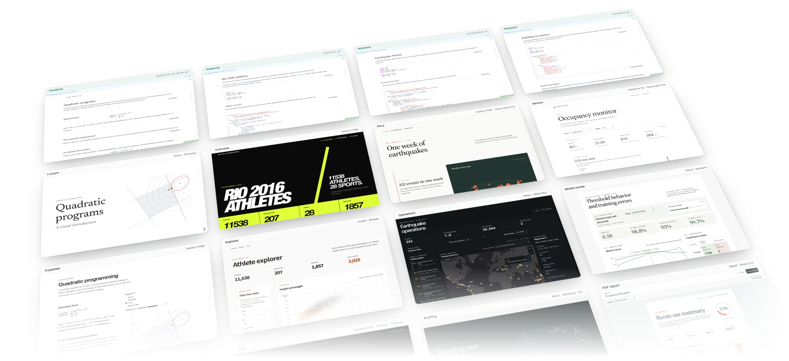
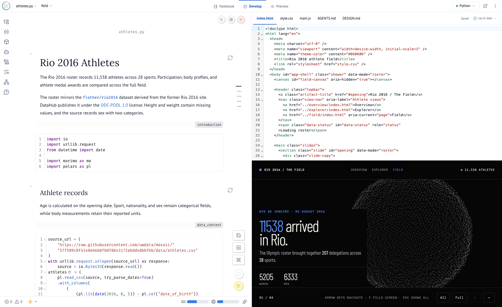

<p align="center">
  <a href="https://marimo-team.github.io/marimo-studio/">
    <picture>
      <source media="(prefers-color-scheme: dark)" srcset="https://marimo-team.github.io/marimo-studio/brand/marimo-studio-lockup-horizontal-dark.svg">
      
    </picture>
  </a>
</p>

<p align="center">
  <a href="https://marimo-team.github.io/marimo-studio/examples/">
    <picture>
      <source media="(prefers-color-scheme: dark)" srcset="apps/docs/public/showcase/marimo-studio-wall-dark.webp">
      
    </picture>
  </a>
</p>

<p align="center">
  <b>One reactive notebook. Many views.</b><br>
  Turn a <a href="https://marimo.io/">marimo</a> notebook into reports, apps, and presentations, by hand or with a coding agent.
</p>

<p align="center">
  <a href="https://github.com/marimo-team/marimo-studio/actions/workflows/ci.yml"></a>
  <a href="https://pypi.org/project/marimo-studio/"></a>
  <a href="https://pypi.org/project/marimo-studio/"></a>
</p>

Studio keeps data, computation, and controls in the notebook and gives each
audience its own view, such as a report, a dashboard, a lab, or a slide deck.
Views render the notebook's live cells and controls, so changing an input
updates the results that depend on it. Each view is its own frontend project,
and every result it shows traces back to the notebook cell that computed it.

> [!NOTE]
> Studio is experimental and changing rapidly. Pin `marimo-studio` in saved
> projects.

## Start with a coding agent

Paste this request into Claude Code, Codex, or another terminal agent:

```text
Run `uvx --with marimo-studio agent-plugins read marimo-studio` and create
a scrollytelling report and a slide deck explaining calculus basics.
```

The agent reads the instructions Studio ships for coding agents, starts a
notebook with Studio in your browser, and writes the calculus in Python cells.
It then builds both views and shows them beside the notebook. Change the topic,
or name a notebook you already have. [uv](https://docs.astral.sh/uv/) supplies
`uvx`.

[Author with a coding agent](https://marimo-team.github.io/marimo-studio/guide/coding-agents)
covers pairing with a running notebook and pointing at results with
[Lens](https://marimo-team.github.io/marimo-lens/).

## Start by hand

```console
uvx --with marimo-studio marimo edit analysis.py --sandbox --watch
```

Add a cell that displays a result, then click **Add view** in the Studio
toolbar. Save the notebook if prompted, choose **HTML document**, and create
the view. Notebook and Preview open side by side. Saving view source rebuilds
Preview, and a failed build keeps the last successful view.



[Getting started](https://marimo-team.github.io/marimo-studio/guide/getting-started)
walks through a complete first view.

## Examples

Each example notebook serves three views, built with different frontend stacks.

| Notebook                                                                                      | Views                                                                                                                                                                                                                                                                                                             | Built with                                                |
| --------------------------------------------------------------------------------------------- | ----------------------------------------------------------------------------------------------------------------------------------------------------------------------------------------------------------------------------------------------------------------------------------------------------------------- | --------------------------------------------------------- |
| [Quadratic programs](https://marimo-team.github.io/marimo-studio/examples/quadratic-programs) | [Lecture](https://marimo-team.github.io/marimo-studio/examples/quadratic-programs/lecture/index.html) · [Explainer](https://marimo-team.github.io/marimo-studio/examples/quadratic-programs/explainer/index.html) · [Lab](https://marimo-team.github.io/marimo-studio/examples/quadratic-programs/lab/index.html) | React, Reveal.js, HTML, Svelte, D3                        |
| [Rio 2016 athletes](https://marimo-team.github.io/marimo-studio/examples/athletes)            | [Overview](https://marimo-team.github.io/marimo-studio/examples/athletes/overview/index.html) · [Explorer](https://marimo-team.github.io/marimo-studio/examples/athletes/explorer/index.html) · [Field](https://marimo-team.github.io/marimo-studio/examples/athletes/field/index.html)                           | HTML, Svelte, Mosaic, Shower, Three.js                    |
| [Earthquake watch](https://marimo-team.github.io/marimo-studio/examples/earthquakes)          | [Story](https://marimo-team.github.io/marimo-studio/examples/earthquakes/story/index.html) · [Operations](https://marimo-team.github.io/marimo-studio/examples/earthquakes/operations/index.html) · [Briefing](https://marimo-team.github.io/marimo-studio/examples/earthquakes/briefing/index.html)              | HTML, Observable Plot, React, MapLibre, Reveal.js, D3     |
| [Building occupancy](https://marimo-team.github.io/marimo-studio/examples/occupancy)          | [Monitor](https://marimo-team.github.io/marimo-studio/examples/occupancy/monitor/index.html) · [Model review](https://marimo-team.github.io/marimo-studio/examples/occupancy/model-review/index.html) · [PDF report](https://marimo-team.github.io/marimo-studio/examples/occupancy/pdf-report/index.html)        | Notebook Kit, Observable Plot, React, Recharts, React PDF |

## Run or export a view

Serve the notebook's views as a live **Python** app:

```console
uvx --with marimo-studio marimo run analysis.py --sandbox
```

Export the `report` view with **Prepared** results as a static site:

```console
uvx marimo-studio view export report --target analysis.py --output dist/report
```

A Prepared export publishes the exported results and finite input states and
keeps notebook source on the machine that runs the export. Views can also run
Python in the visitor's **Browser**.
[Run or export a view](https://marimo-team.github.io/marimo-studio/guide/run-and-share)
compares what visitors receive.

## Documentation

[Guide](https://marimo-team.github.io/marimo-studio/guide/) ·
[Examples](https://marimo-team.github.io/marimo-studio/examples/) ·
[Reference](https://marimo-team.github.io/marimo-studio/reference/) ·
[Troubleshooting](https://marimo-team.github.io/marimo-studio/guide/troubleshooting) ·
[Security](SECURITY.md) · [Contributing](CONTRIBUTING.md)

## License

[Apache License 2.0](LICENSE).
