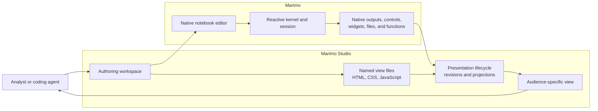
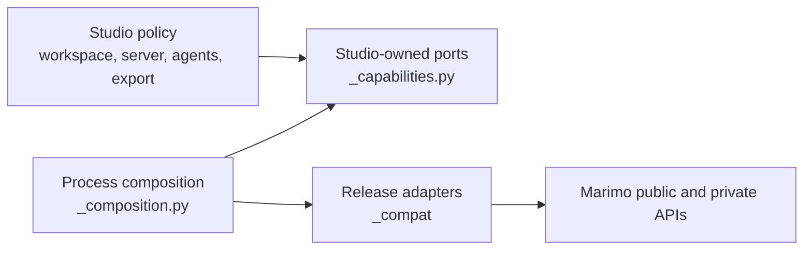

# Architecture

Marimo Studio turns one reactive Marimo notebook into several authored web
views. Marimo remains the computation platform. Studio supplies the product
model, view source, presentation lifecycle, authoring workspace, and delivery
workflows around that platform.

The boundary starts from a user outcome:

```text
one executable notebook
  -> several audience-specific views
     -> native reactive results inside standard web documents
```

## Product boundary from first principles

| Product decision                            | User capability                                                                                            | Complexity Studio accepts                                                                                                        |
| ------------------------------------------- | ---------------------------------------------------------------------------------------------------------- | -------------------------------------------------------------------------------------------------------------------------------- |
| Keep computation in Marimo                  | Data access, transformations, controls, outputs, and reactive dependencies stay executable in one notebook | Studio must address Marimo cells and values without owning notebook execution                                                    |
| Make each view a complete web document      | Authors use HTML, CSS, JavaScript modules, browser APIs, and relative assets                               | Studio must preserve browser document semantics while mounting a long-lived Marimo runtime beside the authored shell             |
| Let one notebook own several named views    | A dashboard, operations page, and executive brief can reuse one analytical graph                           | View selection, routes, source files, revisions, and layouts need one coherent identity                                          |
| Offer Server and WebAssembly runtimes       | A view can use a full Python environment or run on a static browser host                                   | Equivalent projections must map to different cell IDs, sessions, workers, and resource lifetimes                                 |
| Keep notebook, source, and preview together | Authors can change analysis and presentation in one workspace                                              | Frames, source conflicts, query state, controls, and layout must remain coordinated across several documents                     |
| Expose evidence to coding agents            | An agent can inspect, create, activate, repair, and verify a rendered view                                 | Every report must bind static, runtime, and browser evidence to the same notebook, view, revision, runtime, session, and request |



Marimo owns the process, authentication, native routes, notebook execution,
reactive graph, sessions, WebSockets, virtual files, output renderers,
controls, and widgets. Studio owns authored documents, semantic projections,
named views, source editing, runtime selection, cross-frame coordination,
agent evidence, and static packaging.

## Where the complexity comes from

The system is complex where a user-visible promise crosses an ownership or
lifecycle boundary. The complexity is concentrated in six contracts.

| Contract                       | User benefit                                                                                                    | Failure the design prevents                                                         | Primary owner                                                                  |
| ------------------------------ | --------------------------------------------------------------------------------------------------------------- | ----------------------------------------------------------------------------------- | ------------------------------------------------------------------------------ |
| Semantic cell identity         | A view keeps pointing at the intended cell after reordering, formatting, or live edits                          | A projection silently moves to another cell or breaks after a routine notebook save | `_cell_refs.py`, `_workspace.bindings`, save transformation adapter            |
| Coherent source revision       | A preview, runtime configuration, and agent report describe the same saved view                                 | HTML from one save renders with selectors or runtime data from another              | `NotebookPresentation`, `PresentationRevisionController`, source revision APIs |
| Exact runtime ownership        | Switching modes or views preserves the kernel, worker, controls, and widget state owned by each runtime         | Hidden frames reconnect, duplicate a session, or discard browser state              | `PreviewDeck`, runtime SPI, embedded runtime adapter                           |
| Native resource ownership      | Projected controls, virtual files, functions, tables, plots, and widgets clean up with the final rendered owner | A projection leaks Marimo resources or frees resources still used by another host   | kernel projection host and projected-output adapter                            |
| Cross-document synchronization | Notebook query parameters and compatible controls stay aligned across editor and preview documents              | Two visible surfaces show different selections or feed updates back indefinitely    | query and control coordinators plus Studio client registry                     |
| Evidence identity              | An agent hands off the view that was actually rendered and checked                                              | A stale tab or earlier revision satisfies a current validation request              | agent coordinator, analysis report, browser observer                           |

These are product constraints, not incidental framework work. Removing one of
the contracts removes the user capability in the second column or weakens its
failure guarantee.

## Ports and adapters bound the Marimo integration

Studio depends on behavior from Marimo, including behavior that currently
lives behind private APIs. The port and adapter model keeps that dependency at
one boundary.



The direction is deliberate:

1. `_capabilities.py` names the behavior Studio needs with Studio-owned records.
2. `_composition.py` builds the adapter set for a server, tooling command,
   export, programmatic application, or kernel lifespan.
3. `_compat` translates the pinned Marimo release into those ports. Private
   `marimo._*` imports stay in this package.
4. Each process root validates the release before the private capability is
   used. Browser assets carry the same release identity.
5. Stateful adapters return close handles or install through an owned
   lifecycle. Shutdown unwinds registrations and patches in reverse order.
6. `_workspace`, `_server`, `_cli`, public services, and browser policy depend
   on the port or protocol. They do not depend on a concrete private adapter.

When Marimo gains a suitable public extension point, the corresponding
`_compat` adapter can shrink or disappear while the Studio policy and its
consumers retain the same port. When a product requirement changes, change the
port deliberately and update every provider, consumer, diagnostic, and
contract test together.

Read [Marimo integration](architecture/marimo-integration.md) for the complete
port inventory, private seams, lifecycle rules, and upstreaming path.

## Semantic architecture map

The detailed architecture is split by durable product boundary.

| Area                                | Detailed map                                                                   | Questions it answers                                                                                                                               |
| ----------------------------------- | ------------------------------------------------------------------------------ | -------------------------------------------------------------------------------------------------------------------------------------------------- |
| Product and workspace state         | [Product model and workspace](architecture/product-and-workspace.md)           | What is a definition, workspace, view, projection, cell reference, source revision, and view transaction?                                          |
| Marimo platform integration         | [Marimo integration](architecture/marimo-integration.md)                       | Which behavior comes from Marimo, which private seams exist, and how do ports, adapters, validation, and cleanup contain them?                     |
| Browser documents and authoring     | [Browser runtime and authoring](architecture/browser-runtime-and-authoring.md) | How do protocol records, presentation transactions, stable frames, source editing, projections, controls, and query state compose?                 |
| Agents, deployment, and maintenance | [Agents and delivery](architecture/agents-and-delivery.md)                     | How do inspection, activation, analysis, process supervision, CLI output, ASGI hosting, export, packaging, and end-to-end tests prove the product? |

[Frontend workspace](frontend.md) contains the package-level development loop.
[Releasing](releasing.md) contains the publication workflow.

## Ownership zones

| Zone                       | Owns                                                                             | Imports toward                                                 |
| -------------------------- | -------------------------------------------------------------------------------- | -------------------------------------------------------------- |
| `_workspace`               | Configuration, targets, view files, aliases, revisions, transactions, and checks | Stable Python records and injected inspection or runtime ports |
| `_capabilities.py`         | Python integration contracts and opaque Marimo handles                           | Studio records and public framework types                      |
| `_composition.py`          | Process-specific adapter selection and release validation                        | Ports and concrete `_compat` providers                         |
| `_compat`                  | Private Marimo translation and reversible integration                            | The pinned Marimo release and Studio ports                     |
| `_server`                  | Authenticated Studio routes and notebook-scoped coordination                     | Workspace policy and injected capabilities                     |
| `_cli`                     | Human text, JSON, JSON Lines diagnostics, and exit status                        | Public application services                                    |
| `packages/protocol`        | Validated browser and server records                                             | No browser, Marimo, React, or network I/O                      |
| `packages/runtime`         | Runtime registration, mount, update, and disposal contract                       | Protocol only                                                  |
| `packages/presentation`    | One authored view document and its projection lifecycle                          | Protocol, runtime, and named Marimo frontend adapters          |
| `packages/studio`          | The outer notebook, source, and preview workspace                                | Protocol and feature-local ports                               |
| `packages/marimo-frontend` | Unstable Marimo frontend imports and embedded-runtime integration                | Pinned Marimo frontend source                                  |
| `apps/browser`             | Browser entry-point composition and packaged assets                              | Package entry points                                           |
| `apps/e2e`                 | Live acceptance across editor, kernel, filesystem, and preview documents         | The served product boundary                                    |

## Mutable state and release boundaries

| State                                                  | Owner                                           | Released when                                                        |
| ------------------------------------------------------ | ----------------------------------------------- | -------------------------------------------------------------------- |
| Notebook services                                      | `NotebookScopeRegistry`                         | Marimo application lifespan closes                                   |
| Connected browsers and editor sessions                 | `StudioClientRegistry`                          | Client disconnects or notebook scope closes                          |
| Agent activation or observation                        | `AgentCoordinator`                              | Targeted operation completes, cancels, or scope closes               |
| Session attachment, replay, save hooks, and peer relay | Server adapter lifecycle                        | Final server adapter handle closes                                   |
| Document revision                                      | `PresentationRevisionController`                | A newer generation supersedes it or the presentation handle disposes |
| Runtime session                                        | `RuntimeSession` returned by the runtime SPI    | Presentation runtime changes or the document disposes                |
| Projected native resources                             | Kernel and frontend output owners               | Final projection owner releases the selector                         |
| View layout and selected source tab                    | Studio controllers and per-view browser storage | The user resets storage or changes the saved layout                  |

## Reason about a change

1. State the user-visible behavior and the identity that must remain stable.
2. Find the semantic owner in the detailed maps. Add behavior to that owner
   before adding coordination elsewhere.
3. Cross a package or process boundary through a port, protocol record, or
   closeable handle.
4. Keep Marimo-specific mechanics in `_compat` or `packages/marimo-frontend`.
5. Test the nearest public boundary. Add `apps/e2e` coverage when the contract
   crosses editor, kernel, filesystem, session, worker, or preview documents.
6. Run `make build` after browser integration changes and `make e2e` after
   lifecycle or cross-document changes. Finish with `make check`.

This method keeps product complexity visible while preventing Marimo release
details, browser framework details, and cross-feature coordination from
spreading through the repository.
