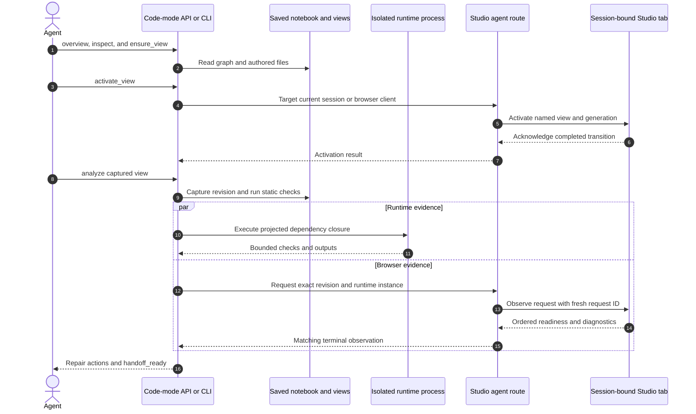
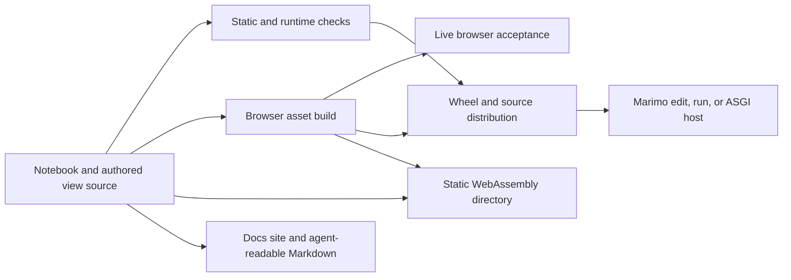

# Agents and delivery

Studio treats authoring, verification, hosting, export, documentation, and
packaging as one product chain. The chain starts from saved notebook and view
source and ends with evidence or an artifact a person can inspect.

The repository skill defines the supported agent workflow. Its capability
catalog maps each operation to two thin interfaces:

```text
skills/marimo-studio
  -> marimo_studio.agent for Marimo code mode
  -> marimo-studio CLI for regular agents and scripts
  -> overview.py, inspect.py, workspace.py, activation.py, checks.py,
     analysis.py, and export.py
  -> _workspace, _server, and Marimo integration ports
```

`agent.py` resolves the active code-mode context and connection. `_cli` owns
command parsing, target and environment selection, credentials, rendering,
and exit status. Request validation, application results, and operation policy
belong to the capability modules below both interfaces. `_capabilities.py`
remains the Marimo integration port layer.

## Semantic inventory

### 1. Workspace overview

`overview` describes configuration and authored views for one saved notebook.
It returns `unconfigured`, `needs-view`, or `ready` and works before the first
Studio mutation.

- **User capability:** an agent can discover the current workspace and its
  next valid operation without probing a failing mutation command.
- **Complexity carried:** notebook target resolution, configuration
  precedence, canonical view roots, and view discovery must describe the same
  source that later capabilities load.
- **Maintenance surface:** `overview.py`, workspace discovery, CLI and
  code-mode adapters, result parity tests, and the capability catalog.

### 2. Static notebook inspection

`inspect_notebook` compiles a saved notebook into `NotebookSpec` and `CellSpec`
records. The records include source spans, native names, semantic references,
definitions, references, upstream and downstream cells, configuration, and an
optional complete cell body.

- **User capability:** a person or agent can understand the notebook graph and
  choose presentation inputs before executing code.
- **Complexity carried:** Marimo graph and compiler objects must become stable,
  serializable Studio records with bounded previews.
- **Maintenance surface:** public inspection API, static notebook adapter,
  types, CLI rendering, agent wrapper, and inspection tests.

### 3. View creation for agents

`ensure_view` resolves the saved notebook, plans or creates a named view, and
returns its paths and configuration changes. A new view starts with every cell
in source order.

- **User capability:** an agent begins from a working page and narrows it to the
  audience's task.
- **Complexity carried:** notebook metadata, project configuration, starter
  aliases, source files, dry-run, and filesystem safety belong to one
  transaction.
- **Maintenance surface:** workspace setup, scaffold templates, public agent
  API, CLI command, and creation tests.

### 4. Stable binding

`bind` maps a human alias to the semantic cell at a zero-based notebook
position. It supports dry-run and explicit overwrite.

- **User capability:** generated HTML can use a memorable cell name that
  survives routine notebook edits.
- **Complexity carried:** an agent must inspect before binding and cannot
  silently replace an existing or ambiguous identity.
- **Maintenance surface:** semantic cell reference logic, binding service,
  metadata writer, CLI and agent APIs, and alias lifecycle tests.

### 5. Browser-targeted activation

`activate_view` selects one connected Studio browser and returns its browser
client, Marimo session, transition, and generation. Code mode resolves its
current Marimo session to the containing browser. The CLI accepts an explicit
browser client or requires the server to have exactly one connected browser.
An active workspace performs an in-place transition and acknowledges its
generation. It selects Build for the notebook and preview. Reactivating the
current view starts a reload of every prepared preview frame and clears its
ready status before acknowledgement.

Edit mode mounts the native editor inside a stable Studio host before a view
exists. First-view activation fills that host with the Build workspace and
positions the original editor frame as its notebook pane. The frame and outer
document keep their identity, so the code-mode stream that requested activation
can receive the acknowledgement and finish its turn. The host carries the
activation generation into the workspace, which acknowledges the transition
before source-editor hydration. Bootstrap and startup failures retry inside the
same host.

- **User capability:** code-mode and regular agents can place the intended tab
  on the view they are about to edit or validate.
- **Complexity carried:** browser client ID, Marimo session ID, active view,
  binding generation, host lifetime, and acknowledgement generation must refer
  to the same tab.
- **Maintenance surface:** `activation.py`, code-mode and CLI adapters, agent
  client, activation route, client registry, workspace event coordinator,
  preview controller, and browser acceptance.

### 6. Three-stage analysis

`analyze_studio` produces one repair-oriented `AnalysisReport`:

1. Static validation compiles and resolves saved source.
2. Runtime validation executes the projected notebook dependency closure in an
   isolated process.
3. Browser validation asks a connected Studio tab to render the captured
   revision and return current diagnostics.

- **User capability:** an agent can distinguish a source error, a Python runtime
  error, and a rendered browser error, then repair the failing boundary.
- **Complexity carried:** every stage must describe one source revision. Static
  failure skips runtime work. Runtime and browser validation can run in
  parallel after static success.
- **Maintenance surface:** `analysis.py`, checks, isolated runtime process,
  agent coordinator, browser observer, protocol parsers, and end-to-end agent
  tests.



### 7. Handoff evidence identity

`AnalysisReport.handoff_ready` requires completed static and runtime checks. A
browser-required report also requires one `ready` observation for every
selected view with matching revision and runtime plus nonempty runtime instance,
browser client, session, and request identities and a nonnegative sequence.

- **User capability:** a rendered view from an earlier save, another runtime,
  another tab, or a replaced session cannot satisfy the current handoff gate.
- **Complexity carried:** freshness is a tuple rather than one Boolean. The
  tuple crosses Python, server events, browser protocol, and presentation
  readiness.
- **Maintenance surface:** `AnalysisReport`, observation request and parser,
  `AgentCoordinator`, rendered observer, and stale-evidence tests.

The identity tuple is:

```text
notebook
view
source revision
runtime ID
runtime instance
browser client ID
Marimo session ID
request ID
observation sequence
```

### 8. Repair queue and structured errors

Static checks, runtime checks, browser diagnostics, transport errors, and source
revision changes become ordered `AnalysisAction` records. Each action carries a
stage, severity, stable code, message, advice, and available view, target, or
source location.

- **User capability:** people see direct repair steps, while agents branch on a
  stable code and retain source context.
- **Complexity carried:** errors from several processes and languages need one
  vocabulary without flattening their owning stage.
- **Maintenance surface:** error classes, protocol parsers, action mapping, CLI
  diagnostics, public references, and schema tests.

### 9. Agent transport and authentication

Code mode obtains callback coordinates from the attached Marimo session. The
agent client authenticates a connection handshake, receives a Studio mutation
token, and sends bounded JSON requests. The external CLI takes the server URL
and access token separately and rejects credentials embedded in the URL.

- **User capability:** agent mutation and browser observation target one
  authenticated notebook server without exposing the token in command history
  or process arguments.
- **Complexity carried:** connection credentials, server token, notebook
  identity, response size, timeout, cancellation, and HTTP errors must remain
  distinct.
- **Maintenance surface:** `_agent_transport.py`, `_agent_client.py`, code-mode
  bridge, agent routes, auth tests, and public agent documentation.

### 10. Runtime process supervision

Runtime analysis starts a bounded child process with standard input closed and
bounded standard output and error capture. Cancellation, deadline, output
overflow, and normal completion all terminate the owned process boundary.

- **User capability:** notebook validation cannot indefinitely occupy the live
  Marimo server, and failures return bounded diagnostics.
- **Complexity carried:** process ownership differs by platform. POSIX uses a
  new process session and group. Windows assigns the suspended child to a
  kill-on-close Job Object before it resumes.
- **Maintenance surface:** `_process_supervisor.py`, `_windows_job.py`,
  `_runtime_process.py`, process tests on Linux and Windows CI, and timeout
  behavior in the CLI reference.

Notebook code that creates another POSIX process session crosses the owned
process-group boundary. Runtime code should keep descendants within the worker
session when the analysis command must own their cleanup.

### 11. Command-line interface

The CLI exposes overview, inspection, binding, view creation, browser
activation and removal, static and runtime checks, complete analysis, and
static export. Every data command offers human text or stable JSON on standard
output and human diagnostics or JSON Lines on standard error.

- **User capability:** the same workflow works interactively, in scripts, and
  through coding agents.
- **Complexity carried:** target discovery, environment re-entry, side-effect
  disclosure, exit codes, stream separation, and interrupt behavior must agree
  across commands.
- **Maintenance surface:** `_cli`, public application services, CLI tests,
  examples, and the CLI reference.

### 12. Notebook environment re-entry

Commands resolve PEP 723 dependencies or project metadata and can re-enter the
notebook environment through `uv`. The adapter builds arguments while the
workspace decides when re-entry is needed.

- **User capability:** runtime inspection and validation use the packages and
  Python requirement declared by the notebook.
- **Complexity carried:** self-contained scripts, managed projects, editable
  Studio source, dependency requirements, recursion guards, and subprocess
  diagnostics must remain coherent.
- **Maintenance surface:** `environment.py`, `_workspace/environment.py`,
  environment adapter, CLI diagnostics, and isolated environment tests.

### 13. Programmatic ASGI application

`create_asgi_app` returns a Marimo run-mode application for one configured
notebook. `marimo_studio.asgi:app` reads the notebook path from
`MARIMO_STUDIO_NOTEBOOK`.

- **User capability:** a service can mount Studio through Uvicorn or another
  ASGI host while retaining Marimo authentication, routes, sessions, and
  per-browser kernels.
- **Complexity carried:** programmatic configuration, parent mount paths,
  initialization state, host authentication, and native route delegation must
  match the regular `marimo run` path.
- **Maintenance surface:** `app.py`, `asgi.py`, programmatic middleware adapter,
  hosted mount tests, and Python API reference.

### 14. Static WebAssembly export

`export_view` resolves one view, validates its projections and output plan,
asks the shared browser projector for the runtime record, stages a complete
directory, then publishes it atomically.

- **User capability:** a compatible notebook can run as a static site with no
  Python server. Relative URLs allow deployment below another base path.
- **Complexity carried:** the bundle includes authored files, notebook source,
  public files, static HTMX fragments, browser assets, runtime configuration,
  and a collision-free destination plan. Existing output replacement needs
  change detection and restoration on failure.
- **Maintenance surface:** `export.py`, export adapters, browser projector,
  asset and collision tests, static runtime acceptance, and package checks.

### 15. Examples and public documentation

The repository ships one-view and multi-view notebooks with committed authored
source. The docs site presents the product model, guide workflows, exact
reference contracts, examples, and clean Markdown for agents through the
VitePress language-model text plugin.

- **User capability:** a person can run a working dashboard or multi-stage
  workflow, then follow the matching guide or inspect the exact API contract.
- **Complexity carried:** examples exercise notebook source, view source,
  dependencies, runtime compatibility, browser behavior, screenshots, links,
  search, and package installation.
- **Maintenance surface:** `examples`, `docs`, `apps/docs`, example checks,
  docs build, link and rendering review, and release support labels.

### 16. Portable agent skill

The root Agent Plugin packages `skills/marimo-studio` as the canonical inspect,
create, activate, edit, analyze, repair, and handoff workflow. The capability
catalog maps every supported operation to its code-mode and CLI surface.
Focused references carry the view grammar and evidence contract.

- **User capability:** an agent receives the repository's intended workflow and
  ownership rules before changing a notebook or view.
- **Complexity carried:** the packaged skill inventory and bytes must match the
  repository tree while its catalog stays aligned with CLI options, API
  signatures, result schemas, projection semantics, and handoff evidence.
- **Maintenance surface:** root `plugin.json`, skill source and references,
  package entry-point metadata, capability parity tests, distribution checks,
  and representative agent runs.

The distribution declares the `marimo.agent.capability` entry point. The
supported Marimo code-mode API exposes it as `studio` through
`cm.capabilities()` and lists the module in `help(cm)`. An agent imports
`marimo_studio.agent` explicitly before calling its authoring operations.

### 17. Browser acceptance

`apps/e2e` starts real Marimo edit, run, and hosted applications in Chromium.
It owns contracts that package tests cannot prove in one process.

| Acceptance area   | User contract proved                                                                               |
| ----------------- | -------------------------------------------------------------------------------------------------- |
| Runtime lifecycle | Editor, Server, and WebAssembly frames retain their state across workspace changes                 |
| Native resources  | Projected output and controls survive valid refreshes and release on final owner removal           |
| Runtime isolation | Anywidget state remains with the runtime that created its model                                    |
| Source authoring  | Browser and disk edits synchronize with explicit conflict handling                                 |
| Cell identity     | Configured aliases follow edited notebook cells                                                    |
| Views and routes  | Creation, removal, relative navigation, and directory routing stay coherent                        |
| Agent evidence    | Activation and rendered observation bind to the current revision and rebind after editor reconnect |
| Recovery          | Missing projected values recover when the notebook definition returns                              |
| Session replay    | A configured run-mode refresh returns to the current server kernel                                 |
| Hosted deployment | Token-protected nested mounting initializes and runs a Studio workspace                            |
| Responsive layout | Authored content and Studio controls remain operable at narrow widths                              |

### 18. Build and package pipeline

`make build` prepares the pinned Marimo frontend source and emits browser entry
points, styles, workers, chunks, and release metadata into the Python package.
`make package` builds wheel and source distributions, checks both, rebuilds a
wheel from the source distribution, and verifies entry points, portable Agent
Plugin files, installed CLI operations, and packaged browser assets in isolated
environments.

- **User capability:** installing the Python distribution supplies the server,
  CLI, Studio workspace, native frontend integration, and static export assets
  as one compatible unit.
- **Complexity carried:** Python and Node locks, exact Marimo source, generated
  assets, package inclusion, entry points, version output, and public install
  behavior must agree.
- **Maintenance surface:** Make targets, Vite build, Python build backend,
  distribution verification script, CI, and release workflow.

## Agent-native operating principles

Keep these properties when adding an agent-facing capability:

1. **Read before mutation.** Provide an inspection record or dry-run that names
   the current notebook, view, source, and revision.
2. **Use the human contract.** Agent APIs call the same workspace services,
   view transitions, source files, and checks that a person uses.
3. **Return stable records.** Every mutable operation returns identifiers,
   generations, paths, or revisions that can be checked on the next step.
4. **Separate streams.** Standard output carries the requested record. Standard
   error carries progress and diagnostics. JSON and JSON Lines remain parseable.
5. **Name recovery.** Stable error codes pair with an action at the boundary
   that owns the failure.
6. **Bind evidence.** Browser readiness includes the view, revision, runtime,
   runtime instance, session, client, request, and sequence.
7. **Bound execution.** Time, response size, output size, concurrency, and owned
   processes have explicit limits.
8. **Expose compatibility.** Checks report the required and observed Marimo and
   browser release identities.
9. **Keep the repository legible.** `AGENTS.md`, development docs, public docs,
   examples, and the reusable skill route an agent to the same sources of truth.

## Delivery graph



## Validation ownership

| Boundary                              | Fast check                            | Release-level evidence                                       |
| ------------------------------------- | ------------------------------------- | ------------------------------------------------------------ |
| Python workspace or service           | Focused `pytest` target               | Python 3.10 through 3.14 matrix plus Windows 3.12            |
| Protocol record                       | Schema and producer or consumer test  | Full frontend tests and package build                        |
| Runtime SPI or presentation lifecycle | Owning package tests                  | Chromium acceptance across Server and WebAssembly            |
| Marimo private adapter                | Adapter and compatibility tests       | Pinned-release job, browser build, and package verification  |
| Agent API or CLI                      | Focused API, parser, and output tests | Live activation and observation acceptance                   |
| Static export                         | Export plan and transaction tests     | Built package and browser-served export                      |
| Public documentation                  | Prose, links, and `make docs-build`   | Rendered desktop and narrow inspection plus current examples |
| Distribution                          | `make package`                        | Isolated wheel and source-distribution install checks        |

## Sources of truth for operations

Read operational contracts in this order:

1. `_compat/release.json` for the required Marimo release and tag commit.
2. `_capabilities.py` for Python integration ports.
3. `packages/protocol` for browser records.
4. Public APIs, CLI parsers, and runtime diagnostics for executable behavior.
5. End-to-end tests for cross-document and cross-process guarantees.
6. Public and contributor guides for workflows.

[Product model and workspace](product-and-workspace.md), [Marimo
integration](marimo-integration.md), and [Browser runtime and
authoring](browser-runtime-and-authoring.md) describe the owners that feed this
delivery chain.
