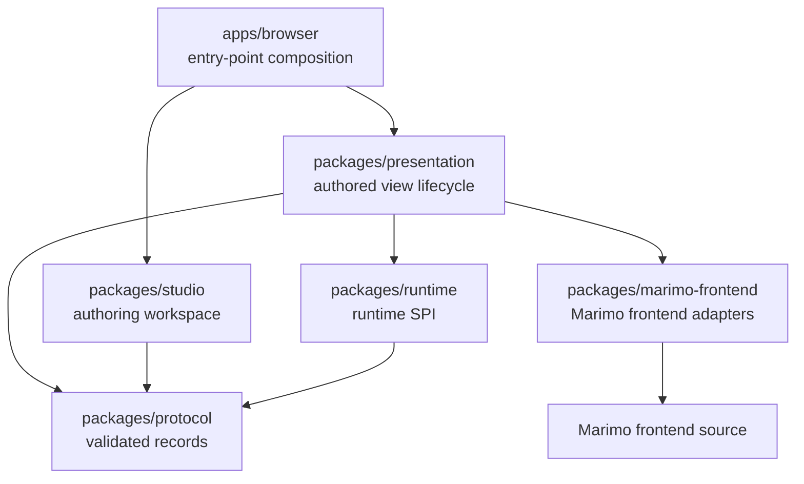
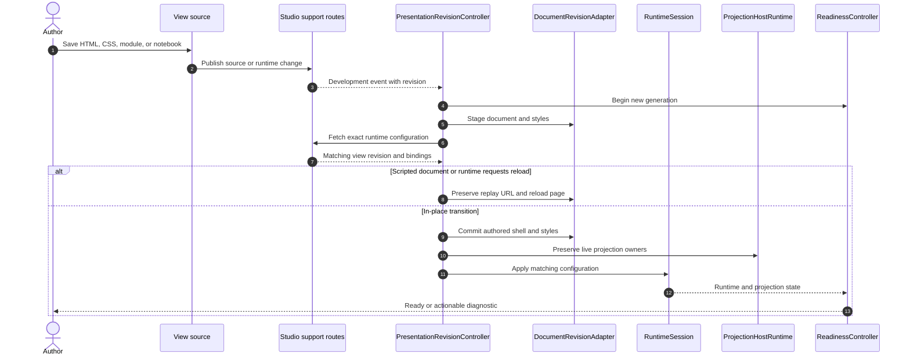
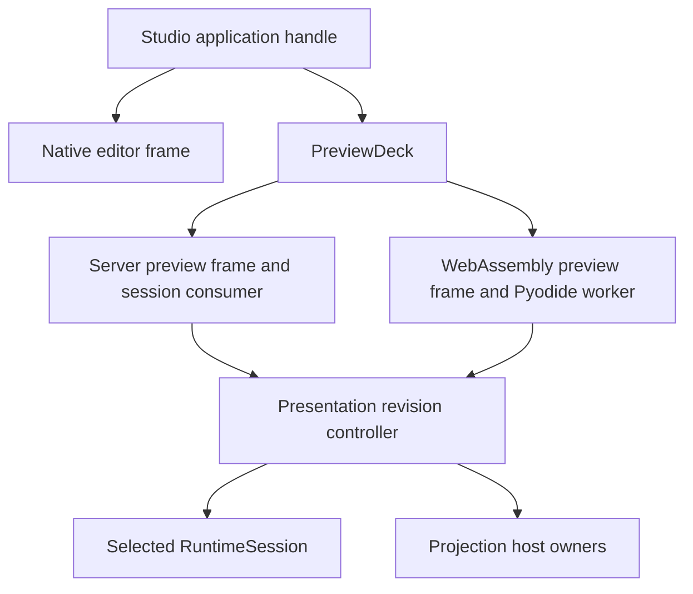

# Browser runtime and authoring

The browser workspace contains two long-lived documents:

- The Studio document composes the notebook editor, source editor, preview
  frames, navigation, and agent events.
- A presentation document owns one authored view, one selected runtime, and the
  cell, output, and value projections mounted into that view.

Keeping these documents separate lets a finished view run without the authoring
workspace while the workspace can retain several runtime frames and switch
which one is visible.

## Package direction



The root Vite configuration enforces these directions. `packages/protocol`
performs no network, filesystem, document object model, or window I/O.
`packages/runtime` performs no Marimo, React, or browser I/O. Studio feature
slices do not import presentation or Marimo frontend code.

## Semantic inventory

### 1. Browser protocol records

`packages/protocol` owns Zod schemas and inferred TypeScript types for bootstrap
records, runtime configuration, source events, view inventory, preview
messages, query state, value reads, output reads, development events, and
browser observations.

- **User capability:** server and browser agree on which notebook, view,
  runtime, revision, session, and request a message describes.
- **Complexity carried:** untrusted JSON must be validated before it affects
  navigation, runtime state, source writes, or agent evidence.
- **Maintenance surface:** protocol schema, Python producer, every browser
  consumer, fixtures, and producer-consumer contract tests.

### 2. Runtime service-provider interface

`packages/runtime` defines the complete browser runtime interface:

```ts
interface PresentationRuntime {
  readonly id: string;
  mount(context: RuntimeContext, data: Readonly<Record<string, unknown>>): Promise<RuntimeSession>;
}

interface RuntimeSession {
  readonly id: string;
  readonly sessionId?: string;
  update(config: RuntimeConfig): "applied" | "reload";
  updateQuery(query: string): Promise<void>;
  dispose(): void;
}
```

- **User capability:** a view can select Server or WebAssembly while the
  authored document and projection lifecycle remain the same.
- **Complexity carried:** runtime-specific transport, mounting, update, query,
  and disposal details stay behind one document-scoped session.
- **Maintenance surface:** `packages/runtime`, runtime registry composition,
  Server and WebAssembly implementations, and runtime conformance tests.

### 3. Presentation bootstrap

`packages/presentation/src/main.ts` establishes relative URL behavior,
restores runtime selection, starts query observation, prepares session replay,
loads runtime configuration, registers projection hosts, initializes view
styles, mounts the selected runtime, and installs page teardown.

- **User capability:** a view can run as a Studio preview, a standalone Marimo
  route, or a static export with the same authored document contract.
- **Complexity carried:** base URL, runtime selection, transient session
  readiness, style generation, host registration, and teardown must occur in a
  fixed order.
- **Maintenance surface:** presentation bootstrap, runtime configuration store,
  session startup, integration tests, and live run-mode acceptance.

### 4. Presentation revision transaction

`PresentationRevisionController` is the transaction owner for navigation and
development refresh. It cancels a superseded generation, marks readiness as
loading, stages the document and runtime configuration, commits or rolls back,
updates the mounted runtime, preserves a session when a page reload is needed,
and publishes terminal readiness.

- **User capability:** HTML, CSS, view navigation, and notebook changes update
  one coherent page while a failed refresh leaves the last valid view visible.
- **Complexity carried:** asynchronous fetches can complete out of order. A
  runtime may apply new configuration in place or require a reload. Scripts
  require the browser's full document lifecycle.
- **Maintenance surface:** `document/revision-controller.ts`,
  `document/revision-document.ts`, `document/revision-runtime.ts`, development
  reload, navigation, and revision transaction tests.



### 5. Document mutation adapter

`DocumentRevisionAdapter` owns mutations to the authored shell, `<base>`,
stylesheets, document title and metadata, browser history, support URL, and
runtime configuration for one transaction.

- **User capability:** regular relative links and assets continue to resolve
  when a view runs under a named route or nested deployment path.
- **Complexity carried:** the document must preserve runtime-owned nodes while
  replacing author-owned nodes and must restore the previous state on failure.
- **Maintenance surface:** document base, styles, scripts, view navigation,
  document revision tests, and nested-base browser acceptance.

### 6. Refresh classification

The source lifecycle distinguishes changes by browser consequence:

| Change                                    | Browser operation                                      | User result                                                                        |
| ----------------------------------------- | ------------------------------------------------------ | ---------------------------------------------------------------------------------- |
| CSS                                       | Refresh matching stylesheets and runtime configuration | Visual changes appear while runtime and document state remain mounted              |
| Scriptless HTML                           | Replace the staged `#app-shell`                        | Structure changes while the runtime root and live projection owners remain mounted |
| Scripted HTML or JavaScript module        | Reload the view document                               | The browser reevaluates the module graph through its regular lifecycle             |
| Notebook, alias, or runtime configuration | Refresh runtime configuration                          | Cell and selector bindings update against the new notebook revision                |
| Invalid staged document or response       | Roll back and publish a diagnostic                     | The last valid shell remains visible for repair                                    |

### 7. Projection host runtime

`ProjectionHostRuntime` composes cell, rich-output, and JSON-value host adapters.
It registers custom elements, connects live value bindings, prepares staged
documents, transfers preserved owners into the committed document, publishes
host changes, and contributes projection states to readiness.

- **User capability:** all three projection forms participate in the same
  document refresh and readiness model.
- **Complexity carried:** each projection keeps its own selector semantics and
  rendering implementation while joining one host lifecycle.
- **Maintenance surface:** `projections/host-runtime.ts`, host adapters, change
  notifications, readiness tests, and live projection acceptance.

### 8. Complete cell projection

`<marimo-cell>` maps a configured alias or native cell name to the selected
runtime cell ID. React portals render Marimo's console and output presentation
inside the authored host.

- **User capability:** a view receives the complete cell result, including
  imperative output, logs when enabled, errors, tables, plots, controls,
  downloads, and widgets.
- **Complexity carried:** output may be loading, stale, ready, missing, or
  failed. A host must preserve the last output during reactive reruns and reject
  duplicate projection owners.
- **Maintenance surface:** `cells`, `runtime/cells`, the cell-presentation
  frontend adapter, output policy tests, and Server and WebAssembly acceptance.

### 9. Native rich-output projection

`<marimo-output>` asks the selected runtime to resolve one value reference and
format the resulting Python object through Marimo's native output registry.
The frontend adapter renders the result as a synthetic presentation cell.

- **User capability:** a DataFrame, plot, Markdown object, control, download,
  or widget can appear independently from the defining cell's complete output.
- **Complexity carried:** the defining notebook cell remains reactive while the
  presentation cell owns formatter-created controls, functions, virtual files,
  and output resources until the final rendered owner releases them.
- **Maintenance surface:** `outputs`, `runtime/outputs`, Python kernel output
  bridge, projected-output frontend adapter, resource lifetime tests, and rich
  output acceptance.

### 10. JSON value projection

`mo-value` resolves a bounded value reference and publishes a JSON snapshot
through element text, the `marimoValue` property, and update or error events.

- **User capability:** authored JavaScript can consume typed notebook data
  through regular document events and properties.
- **Complexity carried:** JSON `null`, unavailable `undefined`, loading, stale,
  unchanged encodings, size limits, event ordering, and nested selector errors
  remain distinct.
- **Maintenance surface:** `values`, `runtime/values`, value protocol, Python
  selector bridge, browser API tests, and the view document reference.

### 11. Readiness and diagnostics

`ReadinessController` reduces runtime, presentation, and projection host state.
The rendered-view observer probes the committed page, publishes
`window.marimoStudio`, updates root data attributes, and sends parent-frame
messages. The agent observer owns one exact observation request.

- **User capability:** browser modules can wait for a settled view, Studio can
  show live or repair status, and agents can require current rendered evidence.
- **Complexity carried:** retained stale content can remain visible while a
  generation is loading. A terminal error in one projection must identify that
  host while healthy regions remain rendered.
- **Maintenance surface:** readiness reducer, rendered observer, agent observer,
  protocol diagnostics, browser API tests, and agent analysis acceptance.

### 12. Scoped view styles

Presentation generates UnoCSS Wind4 utilities from classes in `#app-shell` and
scopes those rules before Marimo-owned output. Authored `app.css` continues to
use the regular cascade.

- **User capability:** authors can use responsive utility classes for the page
  while native Marimo tables, plots, controls, and widgets retain their own
  styles.
- **Complexity carried:** dynamic classes, CSS `@scope` support, semantic theme
  variables, generated rule replacement, and runtime output boundaries must
  remain explicit.
- **Maintenance surface:** `view-styles`, foundation CSS, generator tests,
  rendered desktop and narrow checks, and documentation examples.

### 13. Studio application composition

`createStudioServices` creates the layout, source, view, preview, and workspace
event controllers. `app/` owns coordination across features. Features expose
typed controller ports and import no app module. `shared/` imports no app or
feature module.

- **User capability:** navigation, authoring, preview, view management, and
  agent operations behave as one workspace.
- **Complexity carried:** cross-feature actions need one coordinator instead of
  feature-to-feature imports and event cycles.
- **Maintenance surface:** `packages/studio/src/app`, feature controller ports,
  import-boundary checks, and Studio package tests.

### 14. Workspace modes and pane layout

The layout controller composes three surfaces: native notebook, view source,
and preview. Presets provide Notebook, Build, Preview, and HTML & CSS modes. A
custom workspace can add, remove, move, resize, equalize, and restore panes.
Per-view layout state is stored under the workspace identity.

- **User capability:** the same view can be edited as notebook-first,
  side-by-side, preview-first, source-first, or a saved custom arrangement.
- **Complexity carried:** minimum pane sizes, split geometry, compact layout,
  keyboard and pointer resizing, per-view persistence, and hidden-surface
  activity must agree.
- **Maintenance surface:** `features/workspace`, navigation model, responsive
  CSS, geometry tests, storage tests, and responsive browser acceptance.

### 15. Stable editor and preview frames

The workspace creates the native editor frame and one frame for each prepared
preview runtime. Mode, layout, and visibility changes hide or rearrange frames
instead of remounting them. The preview deck starts a runtime when needed and
retains its controller and frame.

- **User capability:** changing workspace mode preserves editor state, Server
  kernel attachment, WebAssembly worker state, controls, and runtime-local
  widgets.
- **Complexity carried:** a hidden frame still owns resources and can publish
  events. Disposal, view switching, runtime switching, resize, and session
  replacement must target every mounted frame exactly once.
- **Maintenance surface:** `features/preview/deck.ts`, workspace frame
  components, preview controller tests, and runtime lifecycle acceptance.

### 16. Source editor and external edits

The source controller owns one synchronized document for `index.html` and one
for `app.css`. Each buffer autosaves after a short pause using its loaded
revision. The workspace event stream announces disk changes, and the source
controller reconciles the affected buffers against their loaded revisions.

- **User capability:** authors can edit in the browser or an external editor.
  Clean buffers refresh from disk. Dirty buffers expose Compare, Use disk, and
  Keep mine actions.
- **Complexity carried:** writes, event delivery, reads, view switches, and
  autosave timers can race. The controller tracks generations and source
  versions before applying any result.
- **Maintenance surface:** `features/source-editor`, source protocol and server
  routes, synchronization tests, and external-edit acceptance.

### 17. View transitions

`ViewController` owns inventory and mutations. `ViewTransition` prepares source
for the target, commits layout and preview changes, updates history, and cancels
a superseded selection. Removal adds ordered source flush and successor
preparation.

- **User capability:** selecting or removing a view preserves valid source and
  workspace state.
- **Complexity carried:** inventory can change externally, an edit can block a
  transition, and several selection requests can overlap.
- **Maintenance surface:** `features/views`, Studio view APIs, transition tests,
  and live multi-view acceptance.

### 18. Workspace event coordination

`WorkspaceEventCoordinator` owns one server-sent event stream for source
changes, inventory, agent activation, browser observation, and editor-session
binding. It routes source changes to the source controller and prepared preview
frames, then acknowledges a completed targeted activation.

The stream-ready event carries the current presentation revision. Each preview
compares that baseline with its rendered revision and refreshes when they differ.
Preview documents report when their receiver enters and leaves the page, so
changes that cross a document navigation are replayed after the next receiver
starts.

The Studio document, editor frame, preview frames, and event stream carry a
hashed server-instance identifier. A restarted process rejects stale session
connections before session allocation and returns HTTP 204 for stale event
streams. [`EventSource` treats that response as terminal](https://html.spec.whatwg.org/dev/server-sent-events.html),
which releases the browser connection for the current Studio document.

- **User capability:** external view creation appears in the workspace, and a
  coding agent can select and inspect the exact tab attached to its session.
- **Complexity carried:** stream multiplexing, server identity, reconnect
  generations, current view, session replacement, and acknowledgement ordering
  must stay aligned.
- **Maintenance surface:** `app/workspace-event-coordinator.ts`, development
  event protocol, server event routes, unit tests, and agent acceptance.

### 19. Query synchronization

The editor frame, selected preview, Studio URL, and kernel query state exchange
the public notebook query. Private Studio routing keys are filtered. Operation
IDs make editor updates idempotent and prevent feedback loops.

- **User capability:** a view that uses `mo.query_params()` sees the same public
  query when the author changes it in the editor or another prepared runtime.
- **Complexity carried:** history writes do not always emit browser events.
  Server-runtime and WebAssembly updates take different paths. A session may be
  connecting and require bounded retry.
- **Maintenance surface:** protocol query helpers, presentation query observer,
  Studio query controller, server query API, kernel query adapter, and
  cross-runtime acceptance.

### 20. Native control synchronization

The preview controller connects control endpoints for the editor and prepared
runtime. It maps runtime cell IDs through semantic cell identities and
synchronizes JSON-compatible native Marimo control values. Writes coalesce by
object ID.

- **User capability:** matching native controls show the same selected value in
  the editor, Server preview, and WebAssembly preview while each runtime reruns
  its own reactive graph.
- **Complexity carried:** controls must be constructed in the same order in
  corresponding cells. Non-JSON values and runtime-local anywidget models stay
  with their owner. Initial snapshots and concurrent writes need deterministic
  ordering.
- **Maintenance surface:** preview control controller, control endpoint adapter,
  Python peer relay, cell binding records, unit tests, and control acceptance.

### 21. Marimo frontend facade

`packages/marimo-frontend` is the quarantine for imports from Marimo's
unstable browser modules. It exposes named capabilities to presentation and
Studio:

| Adapter             | Contract exposed to Studio                               | Marimo complexity contained                                                          |
| ------------------- | -------------------------------------------------------- | ------------------------------------------------------------------------------------ |
| `embedded-runtime`  | `mountEmbeddedRuntime(options)` and one closeable handle | provider composition, transport, notebook connection, theme, functions, and disposal |
| `cell-presentation` | render one runtime cell through native components        | console, staleness, and output presentation policy                                   |
| `projected-output`  | retain and render one native formatted output            | synthetic cell state, UI elements, virtual files, and final-owner cleanup            |
| `session-bootstrap` | choose or preflight the session before runtime mount     | Marimo browser session singleton ordering                                            |
| `control-endpoint`  | expose native control snapshot, subscription, and apply  | Marimo control registries and multi-owner brokerage                                  |
| `theme-frame`       | synchronize frame theme state                            | Marimo theme atoms and same-origin frame behavior                                    |
| `vite`              | prepare aliases and build inputs                         | pinned upstream source layout and worker assets                                      |

- **User capability:** native Marimo rendering and runtime behavior appear in a
  custom document while Studio imports a small facade.
- **Complexity carried:** provider trees, stores, registries, workers, atoms,
  and source aliases change with the pinned Marimo frontend.
- **Maintenance surface:** facade capability tests, exact-release source
  preparation, `make build`, packaged asset metadata, and live acceptance.

### 22. Server-only real-time collaboration boundary

The browser composition installs Marimo real-time collaboration support for the
Server runtime and keeps the WebAssembly runtime independent.

- **User capability:** the Server view follows the collaboration semantics of
  its Marimo session while a browser worker remains an isolated notebook.
- **Complexity carried:** collaboration providers and transport exist only for
  the runtime that owns a server session.
- **Maintenance surface:** `server-only-rtc.ts`, embedded runtime composition,
  provider tests, and Server runtime acceptance.

### 23. Browser build and asset identity

`apps/browser` registers the Server and WebAssembly runtime implementations,
injects Studio frame adapters, and builds the runtime, development reload, and
Studio entry points. The build records the Marimo version and commit in
`build-meta.json`.

- **User capability:** the Python package carries the complete browser runtime
  needed by edit, run, and export workflows.
- **Complexity carried:** shared chunks, worker files, prepared upstream source,
  CSS, browser entry points, and Python package assets must describe the same
  release.
- **Maintenance surface:** `apps/browser`, Vite configuration, frontend source
  preparation, `_assets.py`, `make build`, and distribution verification.

## Lifetime map



The Studio application owns the frames. Each frame owns one presentation
lifecycle. The presentation owns its selected runtime session and projection
host connections. A projected rich output can also own Marimo resources in the
kernel and frontend. Disposal follows this tree from leaves to root.

## Change and validation map

| Change                                   | Primary owner                                     | Required evidence                                                               |
| ---------------------------------------- | ------------------------------------------------- | ------------------------------------------------------------------------------- |
| Browser record                           | `packages/protocol`                               | schema tests, Python producer test, every consumer test                         |
| Runtime mount or update                  | `packages/runtime` and runtime implementation     | runtime tests, presentation integration, live Server and WebAssembly acceptance |
| HTML, CSS, module, or navigation refresh | presentation document transaction                 | staged commit and rollback tests, development reload acceptance                 |
| Cell, output, or value host              | owning projection adapter                         | host tests, readiness tests, both runtime profiles in acceptance                |
| Workspace layout or mode                 | Studio workspace feature                          | geometry and storage tests, desktop and narrow browser inspection               |
| Source conflict                          | Studio source feature and Python source API       | revision race tests and external editor acceptance                              |
| Query or control sync                    | preview controller plus server or facade endpoint | loop, retry, identity, and cross-runtime acceptance                             |
| Marimo frontend integration              | `packages/marimo-frontend`                        | facade tests, exact-release preparation, `make build`, and browser acceptance   |

[Frontend workspace](../frontend.md) gives the package commands and source
preparation workflow. [Agents and delivery](agents-and-delivery.md) describes
how the browser observer becomes current handoff evidence.
