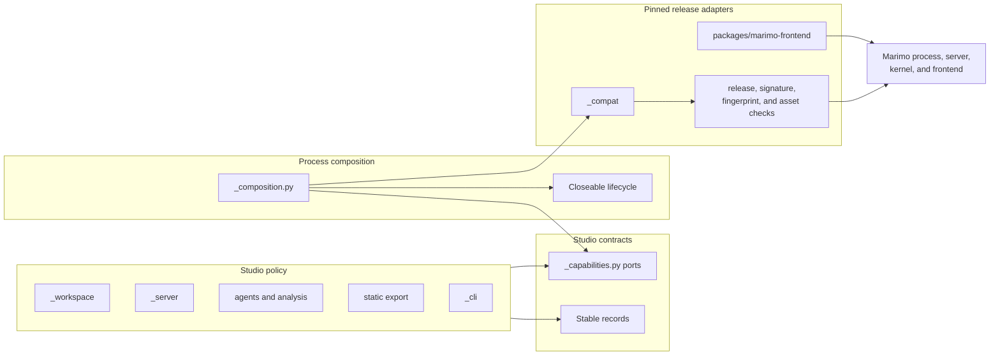
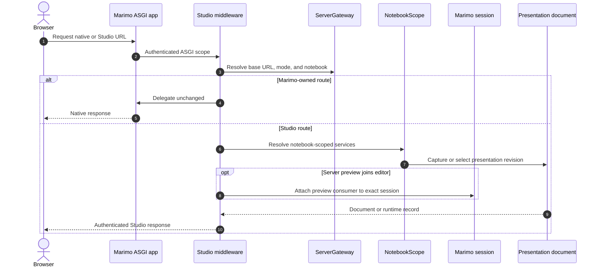
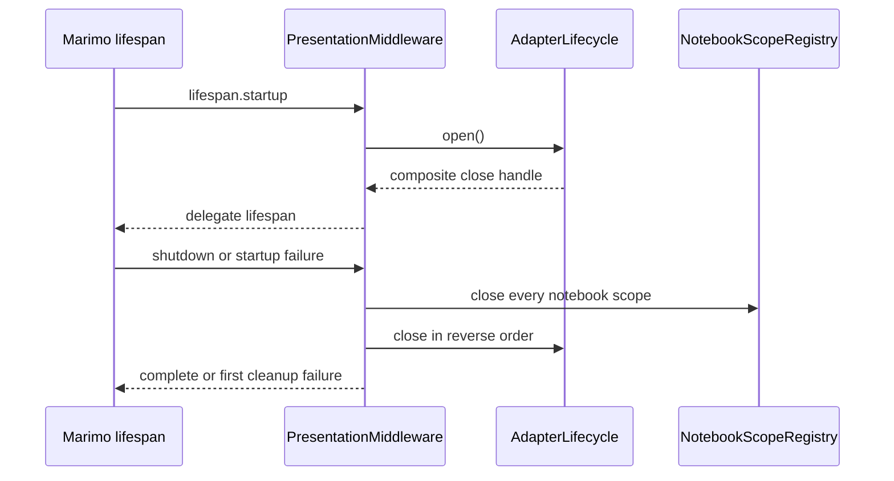

# Marimo integration

Marimo owns the application process and notebook runtime. Studio asks that
platform for a bounded set of capabilities, then expresses the rest of the
product in Studio-owned records and policy.

This boundary supports two goals at once:

- Studio can use the Marimo platform beyond its current public extension
  surface.
- A later Marimo extension point can replace one adapter without redistributing
  private Marimo mechanics through Studio policy.

## Boundary shape



The opaque `ServerHandle` and stable `ServerLocation`, `ServerContext`,
`StaticNotebook`, `BrowserRuntimeProjection`, and projection result records
prevent Marimo session, graph, request, and runtime objects from escaping into
Studio policy.

## Process composition roots

`_composition.py` constructs the capability set at the process boundary.

| Root                                 | Capabilities constructed                                                                                                                                                             | Consumer                                                 |
| ------------------------------------ | ------------------------------------------------------------------------------------------------------------------------------------------------------------------------------------ | -------------------------------------------------------- |
| `create_server_adapters()`           | Server gateway, session state, existing-session attachment, replay, save transformation, kernel projections, peer command relay, browser projection, code-mode bridge, and lifecycle | `PresentationMiddleware`                                 |
| `create_tooling_adapters()`          | Static notebook loader, live runner, environment flags, and code-mode bridge                                                                                                         | inspection, checks, agents, and CLI environment re-entry |
| `create_export_adapters()`           | Browser runtime projector and static runtime configuration                                                                                                                           | `export_view`                                            |
| `programmatic_middleware()`          | A configured Marimo application wrapper for one notebook                                                                                                                             | `create_asgi_app`                                        |
| `kernel_lifespan()`                  | Kernel-side value, output, query, and cached-cell integration                                                                                                                        | Marimo kernel lifespan entry point                       |
| `create_browser_runtime_projector()` | One release-validated browser notebook projector                                                                                                                                     | server previews and static export                        |

Each root validates the pinned release before constructing a private adapter.
The server root installs process-scoped behavior when the Marimo lifespan
starts. Tooling and export roots construct the smaller capability set needed by
their process.

## Port inventory

### Server ports

| Port                        | Studio asks for                                                                                     | Product feature enabled                                                                          | Complexity contained                                                                           |
| --------------------------- | --------------------------------------------------------------------------------------------------- | ------------------------------------------------------------------------------------------------ | ---------------------------------------------------------------------------------------------- |
| `ServerGateway`             | Resolve base URL, mode, notebook, file key, request context, relative path, and shutdown state      | Studio works inside Marimo's edit, run, file-router, and nested ASGI modes                       | Private ASGI state and session-manager objects stay out of routing policy                      |
| `SessionState`              | Validate session IDs, check session existence, inspect live cells, and request a page reload        | Live projections bind to current cell IDs and first-view activation can reload the exact editor  | Session lookup and notification details stay behind an opaque handle                           |
| `ExistingSessionAttachment` | Attach one consumer to one exact existing session                                                   | The Server preview shares the editor kernel, outputs, controls, and anywidget models             | Kiosk connection behavior and consumer attachment are release-specific                         |
| `SessionReplay`             | Mark a server document for reconnect to its current session                                         | A configured run-mode refresh can preserve the browser's kernel state                            | Reconnect selection and routing parameters remain adapter-owned                                |
| `NotebookSaveTransform`     | Install one source transformation at Marimo's durable save boundary                                 | Cell aliases follow live notebook edits and deletions                                            | Marimo persistence and session-extension ordering remain adapter-owned                         |
| `PeerCommandRelay`          | Relay authorized commands among consumers of one session                                            | A native control update reaches the editor and prepared Server preview before kernel application | Session event and broadcast mechanics remain adapter-owned                                     |
| `KernelProjectionHost`      | Read selected values, render selected objects, and synchronize query state through a kernel session | `mo-value`, `<marimo-output>`, and preview query synchronization use the active notebook kernel  | Function calls, queue messages, UI registries, virtual files, and cleanup remain adapter-owned |
| `BrowserRuntimeProjector`   | Derive browser notebook code and selector records                                                   | WebAssembly preview and static export run the same notebook through Marimo's Pyodide runtime     | Notebook rewriting and browser selector plumbing remain adapter-owned                          |
| `CodeModeBridge`            | Attach code-mode session context and expose authenticated Studio server coordinates                 | Code-mode agents activate and analyze the exact notebook workspace                               | Callback credentials and session metadata remain adapter-owned                                 |
| `AdapterLifecycle`          | Install and release process-scoped integrations                                                     | Several Marimo applications can share a process without leaving patches or extensions behind     | Registration order, reference counting, rollback, and cleanup stay centralized                 |

### Tooling and export ports

| Port                        | Studio asks for                                                                                 | Product feature enabled                                                                     | Complexity contained                                                                               |
| --------------------------- | ----------------------------------------------------------------------------------------------- | ------------------------------------------------------------------------------------------- | -------------------------------------------------------------------------------------------------- |
| `StaticNotebookLoader`      | Compile cells, graph relationships, source spans, and app config without evaluating cell bodies | `inspect`, static checks, cell binding, and agent planning                                  | Marimo notebook parsing and graph APIs remain adapter-owned                                        |
| `LiveNotebookRunner`        | Execute selected cells and values in an owned headless session                                  | Runtime checks and the runtime stage of agent analysis                                      | Session creation, dependency execution, output capture, deadlines, and teardown stay adapter-owned |
| `EnvironmentFlagBuilder`    | Build the `uv` arguments for notebook and project metadata                                      | CLI commands run in the notebook's declared environment                                     | Marimo's inline dependency conventions remain adapter-owned                                        |
| `StaticRuntimeConfigLoader` | Resolve user and override configuration for a static browser runtime                            | Static export applies the same Marimo behavior as a browser runtime served from the process | Private configuration loaders remain adapter-owned                                                 |

## Adapter inventory and private seams

The private seams are explicit maintenance obligations. `_compat/layout.py`
records the expected release, callable signatures, and source fingerprints for
the symbols whose behavior the adapters depend on.

### 1. Server context translation

`PrivateServerGateway` reads Marimo's ASGI state, session manager, file router,
mode, base URL, configuration managers, and token state. It returns an opaque
handle plus Studio records.

- **User benefit:** Studio participates in Marimo authentication, file routing,
  nested mounting, and native route delegation.
- **Upgrade surface:** `SessionManager` construction and session lookup shape.
- **Containment:** route handlers receive `ServerContext` and never reach into
  Marimo state directly.

### 2. Existing-session attachment

`PrivateExistingSessionAttachment` registers exact session attachments and
wraps `SessionConnector._connect_kiosk` for Studio preview consumers.

- **User benefit:** the Server preview and native editor share one kernel and
  its live output resources.
- **Upgrade surface:** WebSocket kiosk connection and session selection.
- **Containment:** the preview asks `attach(context, consumer_id, session_id)`.
  It does not construct or select a Marimo session.

### 3. Session replay

`PrivateSessionReplay` records the documents that allow replay and wraps
Marimo's reconnect path.

- **User benefit:** a manual run-mode refresh can return to the current server
  kernel when `preserve_session = true`.
- **Upgrade surface:** reconnect query parameters and
  `SessionConnector._reconnect_session`.
- **Containment:** Studio configuration exposes one Boolean policy. The adapter
  owns the reconnect mechanism and its reversible registration.

### 4. Notebook save transformation

`PrivateNotebookSaveTransform` installs a source-transform extension at
Marimo's notebook persistence boundary. `CellAliasSourcePolicy` supplies the
Studio rule that updates semantic references.

- **User benefit:** aliases remain attached to the intended cell during a live
  editing session.
- **Upgrade surface:** `AppFileManager._save_file`, serialized notebook cells,
  session attach and detach events, and durable write ordering.
- **Containment:** Studio alias policy and Marimo persistence mechanics live in
  separate modules and meet through `NotebookSourcePolicy`.

### 5. Peer command relay

`PrivatePeerCommandRelay` subscribes to session events and relays supported
control commands to the other consumers attached to that session.

- **User benefit:** a native control stays visually aligned between the editor
  and Server preview while the kernel remains the reactive authority.
- **Upgrade surface:** session events, command notification serialization,
  extension registration, and room broadcast.
- **Containment:** server policy calls `enable(location)`. It does not inspect
  Marimo command classes.

### 6. Kernel projection host

The kernel lifespan registers guarded functions for value reads, rich-output
formatting, and query synchronization. `PrivateKernelProjectionHost` invokes
those functions through the current Marimo session.

- **User benefit:** a view can read a selected Python value or render a selected
  object through Marimo's native formatter while retaining reactive ownership.
- **Upgrade surface:** runtime context, function calls, UI element IDs, cell
  lifecycle disposal, virtual files, cached cell restoration, and kernel
  queues.
- **Containment:** server routes exchange `ValueReadResult`,
  `OutputRenderResult`, and `ProjectionUnavailable` records. Kernel objects stay
  inside `_compat/kernel_values`.

The output renderer allocates a stable presentation cell owner for each
consumer and selector. It releases controls, functions, virtual files, and
other formatter-created resources when the final owner disappears.

### 7. Browser runtime projection

`PrivateBrowserRuntimeProjector` derives a browser notebook from the saved
source and the selected value and output references. Server preview payloads
and static export use this same projector.

- **User benefit:** the WebAssembly runtime evaluates the view's required
  notebook graph in Marimo's Pyodide worker.
- **Upgrade surface:** Marimo notebook source conventions, browser runtime
  metadata, selector bridges, and cached UI compatibility.
- **Containment:** callers receive `BrowserRuntimeProjection` with code,
  selector specs, version, commit, and instance identity.

### 8. Static notebook inspection and live execution

The static loader adapts Marimo's notebook compiler and dependency graph into
`StaticNotebook`. The live runner creates an owned headless session, evaluates
the selected dependency closure, captures bounded output, and closes the
session.

- **User benefit:** inspection stays side-effect free until the user requests a
  runtime check. Runtime checks evaluate the actual notebook environment.
- **Upgrade surface:** notebook graph APIs, session creation, execution
  requests, output messages, and cached cells.
- **Containment:** `_workspace` depends on `NotebookInspector` and
  `RuntimeProber` protocols. Commands do not import the concrete runner.

### 9. Code mode and programmatic hosting

`PrivateCodeModeBridge` adapts callback credentials and the active session for
agent operations. Programmatic middleware configures a Marimo run application
for `create_asgi_app`.

- **User benefit:** an agent inside Marimo can target its own Studio tab, and a
  Python service can mount a configured notebook as an ASGI application.
- **Upgrade surface:** code-mode callback state, server configuration managers,
  and Marimo's programmatic application surface.
- **Containment:** public APIs expose `StudioServerConnection` and `ASGIApp`
  contracts.

### 10. Environment and static configuration

The environment adapter translates notebook metadata into `uv` flags. The
static configuration adapter resolves Marimo user configuration and overrides
for browser export.

- **User benefit:** commands use the notebook's declared dependencies, and an
  exported view receives the configured runtime behavior.
- **Upgrade surface:** inline dependency metadata and private config loaders.
- **Containment:** callers work with lists of command arguments or
  `StaticRuntimeConfig` records.

## Server request and session lifecycle



`PresentationMiddleware` delegates before handling. It recognizes the Marimo
base URL and mode, lets native editor and WebSocket requests continue through
Marimo, then handles the Studio landing page, authored documents, view assets,
and support routes for a resolved notebook.

Each canonical notebook path receives one `NotebookScope`:

| Service                | State owned                                                                                            | User capability                                                              |
| ---------------------- | ------------------------------------------------------------------------------------------------------ | ---------------------------------------------------------------------------- |
| `NotebookPresentation` | Source discovery, immutable snapshots, and bounded revision history                                    | coherent live refresh and exact-revision evidence                            |
| `StudioClientRegistry` | Browser presence, editor session binding, active view, binding generations, and query operation claims | exact tab targeting, preview attachment, and loop-free query synchronization |
| `AgentCoordinator`     | Targeted activation and observation operations                                                         | an agent can wait for the intended tab and rendered revision                 |

The registry reuses a scope for repeated requests to the same canonical
notebook. Marimo application shutdown closes every agent coordinator and client
registry, then closes every installed adapter. Cleanup attempts each owned
resource and reports the first failure after all attempts complete.

## Execution matrix

| Context              | Notebook owner                | Runtime state                          | Studio responsibility                                                                                          |
| -------------------- | ----------------------------- | -------------------------------------- | -------------------------------------------------------------------------------------------------------------- |
| Native edit frame    | Marimo editor session         | One Python kernel                      | Bind the editor session to its containing Studio browser                                                       |
| Server preview       | The same editor session       | Attached consumer of the editor kernel | Project the selected view and relay supported peer controls                                                    |
| WebAssembly preview  | Marimo Pyodide runtime        | Separate worker and notebook instance  | Supply derived notebook code, map semantic cell identities, and synchronize compatible control and query state |
| Server run mode      | Marimo run server             | One isolated kernel per browser        | Select the view, configure replay policy, and project that session                                             |
| WebAssembly run mode | Marimo Pyodide runtime        | One worker per browser                 | Supply the selected view and browser notebook record                                                           |
| Static export        | Exported browser assets       | One worker when the page opens         | Package the view, notebook, assets, runtime record, and static fragments                                       |
| Runtime check        | Owned headless Marimo session | Bounded child process and session      | Execute selected dependencies, capture evidence, then terminate the owned boundary                             |

## Release validation

`_compat/release.json` is the release identity shared by Python and browser
integration. Python dependency declarations pin the same Marimo version. The
frontend adapter prepares the commit behind that tag. Browser build metadata
records both values.

`_compat/layout.py` validates:

- The installed Marimo distribution version.
- Callable parameter shape for selected private symbols.
- Source fingerprints for every recorded private contract.
- The private capabilities used by server context, existing-session
  attachment, replay, save transformation, session extensions, cached-cell
  repair, kernel projections, peer relay, and live execution.

Browser runtime construction also validates the packaged asset version and
commit. `marimo-studio check --format json` exposes the required and observed
identities so a person or agent can diagnose a mismatched installation.

### Upgrade the pinned Marimo release

Set `MARIMO_RELEASE` to the target tag and capture the configured version before
editing the release manifest:

```console
MARIMO_REPOSITORY=https://github.com/marimo-team/marimo.git
: "${MARIMO_RELEASE:?Set MARIMO_RELEASE to the target Marimo tag}"
PREVIOUS_MARIMO_VERSION="$(
  uv run python -c \
    'from marimo_studio._compat.layout import MARIMO_VERSION; print(MARIMO_VERSION)'
)"
```

Resolve the target tag to its commit in a current Marimo checkout:

```console
git -C /path/to/marimo fetch \
  "$MARIMO_REPOSITORY" "refs/tags/$MARIMO_RELEASE"
MARIMO_COMMIT="$(
  git -C /path/to/marimo rev-parse 'FETCH_HEAD^{commit}'
)"
printf '%s\n' "$MARIMO_COMMIT"
```

Record that version and commit in `_compat/release.json`. Update the exact
Marimo pins in the root and package `pyproject.toml` files, then resolve and
install the Python environment:

```console
uv lock
uv sync --locked
```

Search the maintained source set for stale release references:

```console
rg -n -F "$PREVIOUS_MARIMO_VERSION" \
  README.md pyproject.toml uv.lock packages apps docs development_docs examples
```

The search should return no release references after the manifests, notebooks,
fixtures, and version-specific prose are current.

Inspect the installed private contracts before changing an adapter:

```console
uv run python -m marimo_studio._compat.layout
uv run pytest \
  packages/marimo-studio/tests/test_compatibility.py \
  -q
```

The snapshot reports each capability, symbol, callable shape, and source
fingerprint. Compare every changed symbol with the tagged Marimo source. Update
a fingerprint when the adapter's required behavior and callable shape still
hold. A changed signature, missing symbol, or changed lifecycle requires an
edit in the owning `_compat` adapter and its contract tests.

Exercise the frontend facade against the same release commit:

```console
pnpm --filter @marimo-studio/marimo-frontend test
make build
```

The frontend preparation step checks out the commit from
`_compat/release.json`, installs that source workspace, and records its identity
in generated browser metadata. Finish the upgrade through every shipped
boundary:

```console
make check
make e2e
make package
```

An upgrade that preserves the product boundary changes release identity,
dependency pins, private contract fingerprints, narrow adapters, adapter tests,
and generated notebook metadata. Documentation names the supported release
through `_compat/release.json` or package metadata and changes when the upgrade
workflow or behavior changes. Marimo-specific behavior stays within `_compat`,
`_composition.py`, or `packages/marimo-frontend`. Changes in workspace policy,
server policy, presentation, or Studio UI require a boundary review before the
upgrade is complete.

## Reversible integration lifecycle

`ReversiblePatch` reference-counts one attribute replacement. It rejects a
competing replacement while Studio owns the seam and restores the original
attribute when the final handle closes. `CompositeCloseHandle` closes in
reverse installation order and retains failed handles for a later retry.



Lifecycle ownership is part of the port contract. A private adaptation that
registers a callback, patch, extension, consumer, function, or process must
return or join a handle whose release boundary is explicit.

## Upstreaming a capability

Treat the port as the durable product requirement and the private adapter as
the current Marimo mechanism.

1. State the required behavior in a Studio-owned port and stable records.
2. Protect the behavior through the consumer boundary and a focused adapter
   conformance test.
3. Design the Marimo extension point around the general platform capability,
   including lifecycle and error behavior.
4. Add a native adapter for the public Marimo API at the composition root.
5. Run the same consumer and conformance tests against the native adapter.
6. Remove the private imports, patch, layout fingerprints, and release-specific
   test fixtures that the native adapter replaced.

An upstream change is clean when `_workspace`, `_server`, agents, export, and
browser policy remain unchanged. If those consumers must absorb Marimo objects
or release details, the port is too shallow or the product policy still lives
inside the adapter.

## Change and validation map

| Change                                   | Primary owner                                                   | Validation                                                                |
| ---------------------------------------- | --------------------------------------------------------------- | ------------------------------------------------------------------------- |
| Marimo server state or route integration | `ServerGateway` adapter                                         | adapter contract tests, native route delegation tests, hosted acceptance  |
| Session attachment or replay             | existing-session or replay adapter                              | reversible patch tests, session tests, run-mode reload acceptance         |
| Notebook save integration                | save adapter and alias policy                                   | source-transform tests, persistence tests, live edit acceptance           |
| Kernel value or output behavior          | kernel projection host                                          | kernel adapter tests, projection tests, Server and WebAssembly acceptance |
| Browser notebook derivation              | browser projector                                               | projector tests, server/export parity tests, `make build`                 |
| Release upgrade                          | release manifest, layout contracts, exact pins, frontend source | compatibility tests, `make build`, `make e2e`, `make package`             |
| Adapter lifecycle                        | patch primitives and server lifespan                            | repeated-open tests, competing-owner tests, failure cleanup tests         |

Continue with [Browser runtime and authoring](browser-runtime-and-authoring.md)
for the document, frame, projection, and frontend adapter lifecycles built on
these Python capabilities.
