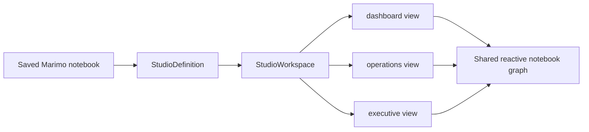
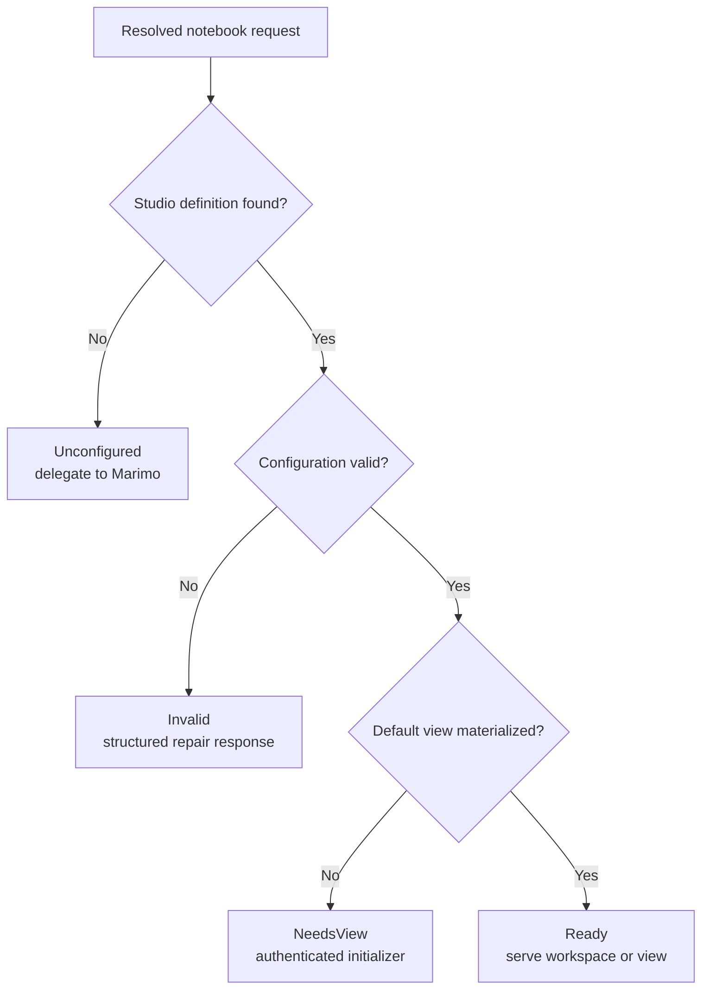

# Product model and workspace state

The workspace model connects a saved Marimo notebook to named view
directories. It gives every route, projection, source edit, runtime record,
and validation result a common notebook and view identity.

## Product nouns

| Noun                  | Contract                                                                                           | User-facing result                                                         |
| --------------------- | -------------------------------------------------------------------------------------------------- | -------------------------------------------------------------------------- |
| Notebook              | The saved Marimo Python file that owns computation and reactive state                              | One executable analytical source remains available to every view           |
| `StudioDefinition`    | Valid configuration plus the canonical notebook path and view root                                 | Studio can recognize a notebook before authored view source exists         |
| `StudioWorkspace`     | A definition with a valid default and materialized views                                           | Edit and run routes can serve a complete authored workspace                |
| View                  | A named directory rooted by `index.html`                                                           | Each audience or task receives its own document, assets, route, and layout |
| Projection            | A complete cell, one Marimo-formatted Python object, or one JSON-compatible value placed in a view | The authored page reuses live notebook results at the level the page needs |
| Cell alias            | A human name mapped to a semantic `CellRef`                                                        | An unnamed cell can be referenced from HTML across ordinary notebook edits |
| Source revision       | A content identity for one editable file or one complete view snapshot                             | Concurrent editors and browser refreshes can detect stale input            |
| Presentation snapshot | Resolved view source, notebook source, bindings, diagnostics, and revision captured together       | One request or browser transaction sees a coherent definition              |

## Semantic inventory

### 1. Target and configuration discovery

`_workspace.config` resolves configuration from notebook PEP 723 metadata or a
matching `pyproject.toml`. Notebook metadata wins when both identify the same
notebook. Directory targets must resolve to one configured notebook.

- **User capability:** commands can accept a notebook, project directory, or
  project configuration. A self-contained notebook can carry its Studio setup.
- **Complexity carried:** path canonicalization, precedence, conflicting
  definitions, project-relative notebook paths, and configuration validation.
- **Maintenance surface:** `_workspace/config.py`, `_workspace/targets.py`,
  `_workspace/metadata.py`, configuration tests, and the configuration
  reference.

### 2. Definition before materialization

A `StudioDefinition` can exist before the first view directory. A
`StudioWorkspace` requires at least one view and a `default` that names a
materialized view.

- **User capability:** teams can commit configuration first. An authenticated
  edit session can create the first view through the browser initializer.
- **Complexity carried:** routes must distinguish configured, initialized, and
  invalid workspaces instead of treating every missing file as the same error.
- **Maintenance surface:** `_workspace/models.py`, `_server/workspace_lifecycle.py`,
  `_server/studio/initialize.py`, and hosted lifecycle acceptance tests.

### 3. Named view inventory and routes

Every immediate child of the notebook's Studio view root with an `index.html`
is a view. The configured default opens at `/`. Each name also opens at
`/<view-name>/`.

- **User capability:** one notebook can serve a detailed workbench, an
  operations surface, and a concise decision page from the same reactive
  definitions.
- **Complexity carried:** names must avoid native and Studio route collisions.
  Default selection must remain valid after creation and removal.
- **Maintenance surface:** `_workspace/views.py`, `_workspace/config.py`,
  `_server/routing.py`, `packages/studio/src/features/views`, and live view
  management tests.

### 4. View directories as web source

A view is a directory whose `index.html` is the document root. `app.css`,
JavaScript modules, images, fonts, nested assets, relative imports, and CSS
`url(...)` references use ordinary browser resolution.

- **User capability:** authors and coding agents use standard web tools and can
  commit the presentation beside the notebook.
- **Complexity carried:** development serving, static export, nested base URLs,
  reserved paths, MIME handling, and source refresh must agree on one path
  model.
- **Maintenance surface:** `_server/files.py`, `_server/pages.py`,
  `_workspace/sources.py`, `export.py`, view document tests, and browser
  acceptance.

### 5. Authored document grammar

`TemplateParser` validates one `<head>`, one `<body>`, and one `#app-shell`.
Projection hosts stay inside the shell. Reserved runtime markup, duplicate cell
aliases, duplicate rich-output selectors, malformed value selectors, and
excess output selectors produce source-located diagnostics.

- **User capability:** the view remains a complete HTML document while Studio
  can replace its authored shell and preserve the mounted runtime.
- **Complexity carried:** HTML discovery must preserve browser semantics and
  supply line and column information for repair.
- **Maintenance surface:** `_workspace/templates.py`,
  `_workspace/bindings.py`, protocol diagnostics, presentation host discovery,
  and the view document reference.

### 6. Three projection levels

`<marimo-cell>` selects complete cell output. `<marimo-output>` selects one
Python object and asks Marimo to format it. `mo-value` resolves and serializes
one JSON-compatible value for HTML and JavaScript.

- **User capability:** a page can choose native fidelity, native formatting,
  or browser-native data without moving analytical logic into presentation
  code.
- **Complexity carried:** cell aliases, variable definitions, nested selectors,
  duplicate hosts, value size limits, loading state, and runtime-specific cell
  IDs must align.
- **Maintenance surface:** `_workspace/bindings.py`, `values.py`, projection
  protocol records, `packages/presentation/src/{cells,outputs,values}`, and
  projection acceptance tests.

### 7. Semantic cell references

`CellRef` stores a semantic abstract syntax tree fingerprint, a
layout-normalized fingerprint, and the occurrence number for duplicate cell
bodies. Native Marimo cell names remain the direct reference when available.

- **User capability:** an alias follows an unnamed cell across reordering,
  comments, formatting, and compatible Marimo markdown layout changes.
- **Complexity carried:** fallback matches must be unique. Distinct configured
  aliases cannot collapse onto one candidate. Meaning-changing or ambiguous
  offline edits require explicit rebinding.
- **Maintenance surface:** `_cell_refs.py`, `_workspace/bindings.py`,
  `_workspace/metadata.py`, save transformation policy, binding tests, and live
  save acceptance.

The matching order is:

1. Match the semantic fingerprint and duplicate occurrence.
2. Fall back to a unique layout-normalized candidate.
3. Reject ambiguous candidates.
4. Reject an automatic update that would merge previously distinct bindings.

### 8. Live alias save transformation

During an active edit session, the notebook save extension observes Marimo's
live cell identities and rewrites configured aliases as part of the notebook
save transaction. The Studio policy decides alias changes. The Marimo adapter
owns the persistence hook.

- **User capability:** aliases follow live cell edits and disappear when their
  cell is deleted.
- **Complexity carried:** source transformation and durable persistence must
  commit in order. A failed write cannot publish new alias metadata.
- **Maintenance surface:** `_server/cell_alias_policy.py`,
  `_compat/server/notebook_save.py`, `_workspace/metadata.py`, adapter lifecycle
  tests, and end-to-end notebook save coverage.

### 9. Per-file source revisions

The browser source editor reads `index.html` and `app.css` with a SHA-256
content revision. A write supplies the expected revision. The server performs
an atomic replacement when the revision still matches.

- **User capability:** Studio can coexist with an external editor. A clean
  buffer accepts the disk update. A dirty buffer presents the local and disk
  versions with explicit choices.
- **Complexity carried:** autosave, event delivery, stale writes, deletion,
  UTF-8 validation, and mutable symlink rejection must converge on one source
  state.
- **Maintenance surface:** `_workspace/sources.py`, `_workspace/files.py`,
  `_server/source_changes.py`, `packages/studio/src/features/source-editor`,
  and source conflict tests.

### 10. Complete presentation revisions

`capture_studio_sources` reads configuration, notebook source, selected HTML,
and view assets in one filesystem pass. Its revision includes shared
configuration identity, notebook content, document content, and asset
identities.

- **User capability:** live refresh and agent analysis can prove which saved
  view was rendered.
- **Complexity carried:** changing an asset, alias, runtime option, notebook, or
  document must invalidate the affected presentation even when `index.html`
  itself is unchanged.
- **Maintenance surface:** `_workspace/revisions.py`,
  `_server/presentation.py`, revision protocol fields, presentation revision
  tests, and agent observation tests.

### 11. Immutable presentation snapshots

`NotebookPresentation` resolves a view against one source capture and retains
bounded immutable snapshots by revision. A request can ask for the current
snapshot or an exact recent revision.

- **User capability:** a browser can stage runtime configuration for the same
  view source it is about to commit. An agent can request evidence for a
  captured revision.
- **Complexity carried:** snapshots require bounded retention, concurrent
  access, invalidation, and an explicit response when a requested revision has
  expired.
- **Maintenance surface:** `_server/presentation.py`,
  `_server/runtime_config_api.py`, `_server/presentation_payload.py`, and
  revision coherence tests.

### 12. Multi-file creation transactions

`ensure_view` creates the starter `index.html` and `app.css`, then updates the
notebook or project configuration as one planned operation. Dry-run returns
the same paths and configuration changes without writing.

- **User capability:** the first command produces a working preview. Agents can
  inspect the complete write plan before mutation.
- **Complexity carried:** partial files, conflicting configuration, symlink
  traversal, and a failed later write must not leave a half-configured view.
- **Maintenance surface:** `_workspace/setup.py`, `_workspace/scaffold.py`,
  `_workspace/transactions.py`, CLI and agent wrappers, and setup tests.

### 13. Ordered view removal

The server workflow flushes active source, prepares a successor, retargets
preview and source streams, removes the old view, and commits the returned
inventory. The filesystem operation stages the directory and updates the
default with restoration on failure.

- **User capability:** removing the selected view leaves the workspace on a
  valid remaining view with saved source.
- **Complexity carried:** UI state, live streams, configuration, and filesystem
  deletion must change in one observable order.
- **Maintenance surface:** `_workspace/views.py`, `_server/studio_api.py`,
  `packages/studio/src/features/views`, and live removal acceptance.

### 14. Static and runtime checks

Static checks compile the notebook graph, validate documents, resolve cell
aliases, bind value and output selectors, inspect assets, and validate the
pinned integration. Runtime checks execute the required dependency closure in
an owned session and inspect actual values and MIME output.

- **User capability:** authors can find a missing projection before opening a
  browser and can verify runtime-dependent values before sharing.
- **Complexity carried:** static checks must leave cell bodies unevaluated.
  Runtime checks must declare their side effects, bound execution, and report
  structured source locations.
- **Maintenance surface:** `_workspace/checks.py`,
  `_workspace/runtime_checks.py`, `checks.py`, runtime probe adapter, CLI
  diagnostics, and check contract tests.

## State coherence rules

Keep these invariants when changing the workspace model:

1. A request resolves one canonical notebook and one request-scoped lifecycle
   state.
2. A `Ready` workspace has at least one view and a valid default.
3. A view name identifies its directory, route, source stream, layout storage,
   runtime request, diagnostics, and agent evidence.
4. A presentation revision includes every source that can alter the rendered
   view or its runtime configuration.
5. A conditional source write compares the revision read by that editor.
6. A cell alias either resolves uniquely or produces an actionable diagnostic.
7. A view mutation commits configuration and filesystem state together or
   restores the previous durable state.

## Change and validation map

| Change                            | Owning code                                                          | Required evidence                                                     |
| --------------------------------- | -------------------------------------------------------------------- | --------------------------------------------------------------------- |
| Configuration field or precedence | `_workspace/config.py`, metadata writer, public configuration schema | Focused Python tests, CLI or API result, configuration docs           |
| View naming or route              | workspace config, server routing, Studio view controller             | Python route tests, protocol checks, browser acceptance               |
| Document grammar or selector      | template parser, resolver, protocol, presentation host               | Parser tests, producer and consumer tests, live projection acceptance |
| Cell reference behavior           | `_cell_refs.py`, binding policy, save transform                      | Unit cases for edits and ambiguity, live save acceptance              |
| Source save or conflict behavior  | source service and source editor feature                             | Revision tests and external-edit browser acceptance                   |
| Snapshot identity                 | workspace revisions and `NotebookPresentation`                       | Exact-revision tests and agent evidence tests                         |
| View creation or deletion         | workspace transaction and Studio transition                          | Filesystem rollback tests, CLI behavior, browser acceptance           |

Continue with [Marimo integration](marimo-integration.md) for the adapters that
connect this product model to Marimo sessions, kernels, saves, and browser
runtimes.
