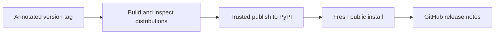

# Releasing Marimo Studio

An annotated `vX.Y.Z` tag on `main` starts the trusted PyPI publication
workflow. The tag version must match the version in
`packages/marimo-studio/pyproject.toml`.

## Know what a release contains

A release is one coordinated compatibility unit:

- The `marimo-studio` Python package and command.
- Marimo server middleware, kernel lifespan, and agent capability entry points.
- Generated Studio, presentation, runtime, and WebAssembly browser assets.
- The supported Marimo version, tag commit, and private layout fingerprints in
  `_compat/release.json`.
- The wheel and source distribution metadata needed to rebuild the same wheel.

Treat a Marimo upgrade as an integration change before treating it as a
version bump. Follow [Marimo integration](architecture/marimo-integration.md)
to update the pinned release, validate private capabilities, rebuild browser
assets, and exercise every process root.

## Prepare the release pull request

Start from current `main`, then update the package version:

```console
uv version --package marimo-studio --bump patch
```

Use `minor`, `major`, or an explicit final version when that matches the
release. Commit the package manifest and `uv.lock`. Commit `pnpm-lock.yaml`
when JavaScript dependency inputs changed.

Run the release gates from the repository root:

```console
make install
make check
make e2e
make package
```

The gates provide different evidence:

| Gate           | Release contract                                                                                                                     |
| -------------- | ------------------------------------------------------------------------------------------------------------------------------------ |
| `make check`   | Formatting, static analysis, package tests, frontend tests, and configured quality checks pass                                       |
| `make e2e`     | The native editor, kernel, filesystem, workspace, and authored view work together in a browser                                       |
| `make package` | Browser assets build, both wheel paths install, entry points load, worker chunks exist, and the command reports the packaged version |

Build the public documentation when the release changes a supported feature or
workflow:

```console
make docs-build
```

Merge after the **CI**, **Browser acceptance**, and documentation workflows
pass on the release commit.

## Verify the exact release commit

Update local `main`, then run the preflight:

```console
git pull --ff-only origin main
./scripts/release.sh --dry-run
```

The preflight validates these conditions:

1. The current branch is `main`.
2. The working tree is clean.
3. Local `main` matches `origin/main` after fetching branches and tags.
4. The package version has final `X.Y.Z` form.
5. The corresponding `vX.Y.Z` tag is available.
6. The push-triggered **CI** workflow passed for the exact commit.

The command prints the release tag, commit, and CI URL. Match the separate
**Browser acceptance** result to the same commit before publishing.

## Start publication

Create and push the annotated tag:

```console
./scripts/release.sh
```

The tag starts `.github/workflows/publish.yml`.



| Job             | Responsibility                                                          | Evidence                                          |
| --------------- | ----------------------------------------------------------------------- | ------------------------------------------------- |
| `build`         | Validate tag form, package version, ancestry, and distribution contents | Wheel and source distribution artifact            |
| `publish`       | Publish both artifacts through PyPI Trusted Publishing                  | Immutable public package version                  |
| `verify-pypi`   | Install the exact public version in an isolated environment             | Import succeeds and packaged runtime assets exist |
| `release-notes` | Generate the GitHub release after public verification                   | Release page tied to the published tag            |

The repository `pypi` environment must be configured as a
[PyPI Trusted Publisher](https://docs.pypi.org/trusted-publishers/).

## Verify the user path

The publication workflow proves that a clean environment can install and
import the public artifact. For a release that changes startup, browser assets,
or integration behavior, also exercise the smallest public workflow against
the released version:

```console
uvx marimo-studio --version
uvx marimo-studio check path/to/notebook.py
```

Use a representative configured notebook when the change affects Marimo
startup, projections, runtime selection, or static export. The checked
notebook should exercise the capability that changed.

## Recover a failed publication

Inspect the first failed job and preserve the evidence from that boundary.

| First failed job                           | Response                                                                                                          |
| ------------------------------------------ | ----------------------------------------------------------------------------------------------------------------- |
| `build`                                    | Correct the source or packaging input, bump the version as needed, and publish from a new validated commit        |
| `publish` before PyPI accepted the version | Resolve the trusted-publishing or service problem, then rerun the workflow                                        |
| `verify-pypi`                              | Check index propagation and the installed artifact. Prepare a patch release when the public artifact is defective |
| `release-notes`                            | Rerun after the public package has verified                                                                       |

PyPI versions are immutable. Once `publish` completes, preserve that artifact
and prepare a new patch version for a code or package-content correction.

If the tag push itself fails, `scripts/release.sh` deletes the local tag. Fix
the remote problem and run the command again from the same validated commit.
