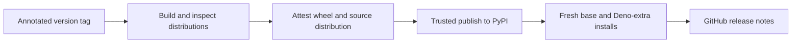

# Releasing Marimo Studio

An annotated `vX.Y.Z` tag on `main` starts the trusted PyPI publication
workflow. The tag version must match
`packages/marimo-studio/pyproject.toml`.

## Release unit

A release contains one coordinated compatibility unit:

- `marimo-studio` Python package and CLI
- Marimo server middleware, kernel lifespan, and agent capability entry points
- `marimo_studio.view_provider` entry points
- Vanilla, React, and Svelte provider implementations
- Provider analyzers and project starters
- Provider guides and the Marimo Studio
  [Agent Plugin](https://github.com/peter-gy/agent-plugins)
- Optional Deno dependency metadata
- Generated Studio, presentation, runtime, and WebAssembly browser assets
- Supported Marimo version, tag commit, and private layout fingerprints
- Wheel and source distribution metadata needed to rebuild the same wheel
- Distribution checksums and GitHub build provenance

Provider info, packaged starters, module help, CLI catalogs, browser
assets, and public docs should describe the same release.

## Dependency identity

Define release-affecting version policy in its owning manifest or lockfile:

- uv range from `[tool.uv].required-version` in the root `pyproject.toml`
- Marimo Python requirement
- Deno Python distribution and executable
- React and React DOM starter imports
- `@revealjs/react` and Reveal.js starter imports
- Svelte compiler
- Official Svelte Vite plugin
- Vite, TypeScript, and source analyzers
- Starter lockfiles

Review dependency and lockfile changes before adding them. Run `make audit`
after a dependency change. Respect the machine package-age policy and stop
when an age gate rejects a release.

## Prepare the release pull request

Start from current `main`, then update the package version:

```console
uv version --package marimo-studio --bump patch
```

Use `minor`, `major`, or an explicit final version when that matches the
release. Set the same Studio pin in
`apps/e2e/fixtures-provider/provider/pyproject.toml`, then commit both manifests
and `uv.lock`. Commit `pnpm-lock.yaml` when JavaScript dependency inputs
changed. Commit view-project lockfiles when a packaged starter changes its
frontend dependencies.

Update the versioned public communication surfaces as one change:

- Root `README.md`
- `packages/marimo-studio/README.md`
- Installation and compatibility commands under `docs/`
- Provider examples under `docs/`
- `skills/marimo-studio/SKILL.md`
- `.github/release-notes/vX.Y.Z.md`

Search the tracked public sources for the previous version before committing.
Keep version claims, supported Marimo release, provider extras, and example
commands aligned. [Documentation delivery](documentation.md#version-parity)
owns the complete parity contract.

Run the release gates from the repository root:

```console
make setup
make check
make audit
make e2e
make docs-build
make package
```

The gates provide different evidence:

| Gate              | Release contract                                                                                                                      |
| ----------------- | ------------------------------------------------------------------------------------------------------------------------------------- |
| `make check`      | Formatting, static analysis, package tests, frontend tests, and provider checks pass                                                  |
| `make audit`      | Locked Python and JavaScript dependencies have no known vulnerabilities                                                               |
| `make e2e`        | Provider builds, native editor, Source, artifact preview, kernel, worker, dynamic projections, and view switching compose in Chromium |
| `make docs-build` | Public navigation, examples, and reference pages build                                                                                |
| `make package`    | Browser assets, distributions, provider entry points, starters, optional extras, and installed commands verify                        |

Merge after CI, Browser acceptance, and documentation workflows pass on the
release commit.

## Validate packaged providers

`make package` builds the wheel, source distribution, and source-rebuilt wheel
before checking metadata on all three. `scripts/verify-dist.sh` requires the
two wheels to be byte-identical, then runs the installed-package matrix once.

The base installation verifies:

- Package version and import
- Python compatibility, exact runtime dependencies, and package license metadata
- Public import allowlist and `py.typed`
- Runtime and Studio browser assets
- Provider, agent, and CLI entry points
- Agent Plugin discovery through `agent_plugins.locate()`
- Starter discovery and the default vanilla starter
- Vanilla view creation, publication, and static validation
- Separately packaged provider creation, build, and type checking
- Packaged Agent Plugin resources in both distributions
- Absence of the optional Deno runtime from the base installation
- Saved React and external-provider views bootstrap their exact requirements
  from a base installation for view creation, status, source inspection,
  reading and writing, static validation, production build, and static export

The package gate also enforces these release budgets:

| Artifact                            |    Budget |
| ----------------------------------- | --------: |
| Wheel or source distribution        |     8 MiB |
| Browser asset files                 |       400 |
| Browser asset bytes                 |    24 MiB |
| Entry static-import graph           |   850 KiB |
| Gzipped entry static-import graph   |   225 KiB |
| Server or WebAssembly startup graph | 6,500 KiB |
| Gzipped runtime startup graph       | 2,200 KiB |
| Studio Source startup graph         | 1,300 KiB |
| Gzipped Studio Source graph         |   375 KiB |

`make package` writes `dist/SHA256SUMS` for the release wheel and source
distribution. The publish workflow attests those files against the tag commit
and attaches the distributions and checksum manifest to the GitHub release.

`scripts/verify-pypi.sh` polls for the exact package version with a minimal
probe. After the version appears, it runs the complete base check and Deno
check once. The Deno check creates and builds the React application starter,
Reveal.js slide deck starter, and Svelte application starter with the published
package.

Both scripts use isolated, uncached environments while retaining the
repository dependency-age policy.

## Validate the pinned Marimo release

Treat a Marimo upgrade as an integration change before a version bump. Follow
[Marimo integration](architecture/marimo-integration.md) to update:

- Exact Python pin
- `_compat/release.json`
- Private Python adapters
- Prepared frontend source
- Browser build metadata
- Server and WebAssembly acceptance
- Package verification

The release manifest, installed Marimo distribution, prepared frontend commit,
and generated browser assets must identify the same release.

## First public release preflight

Before tagging `v0.1.0`, verify the external repository and publishing settings
once. These settings live outside Git and `scripts/release.sh`. Record the
observed status and supporting GitHub or PyPI settings links in the release pull
request. Keep credentials and private vulnerability details out of that record.

| Check                               | Required observation                                                                                                                     |
| ----------------------------------- | ---------------------------------------------------------------------------------------------------------------------------------------- |
| Repository visibility               | `marimo-team/marimo-studio` is public and `main` is the default branch                                                                   |
| Issues                              | Issues are enabled and the public issue page opens                                                                                       |
| GitHub Pages                        | Pages uses GitHub Actions, a successful `main` deployment exists, and the reported site URL is the intended documentation URL            |
| Private vulnerability reporting     | The private report form opens from the repository Security view without submitting a report                                              |
| Secret scanning and push protection | Availability and enabled state are recorded, with an explicit release decision for any unavailable control                               |
| Branch protection or rules          | Effective settings for `main` are visible. Required checks match current workflows, and force-push and deletion policy is explicit       |
| Trusted publishing                  | The PyPI publisher matches owner `marimo-team`, repository `marimo-studio`, workflow `publish.yml`, and GitHub environment `pypi`        |
| Repository metadata                 | The description, homepage, and topics describe the current public product and documentation                                              |
| Security reporting path             | `SECURITY.md` is visible on `main`, GitHub recognizes it as the security policy, and its private or fallback reporting path is reachable |

Resolve every discrepancy before creating the tag, then continue with the exact
release-commit preflight.

## Verify the exact release commit

Update local `main`, then run the preflight:

```console
git pull --ff-only origin main
./scripts/release.sh --dry-run
```

The preflight validates:

1. The current branch is `main`.
2. The working tree is clean.
3. Local `main` matches `origin/main` after fetching branches and tags.
4. The package version has final `X.Y.Z` form.
5. The corresponding `vX.Y.Z` tag is available.
6. Push-triggered CI, Browser acceptance, and documentation passed for the
   exact commit.

The command prints the release tag, commit, and all three workflow URLs. The
publish workflow repeats the exact-commit check before building artifacts.

## Start publication

Create and push the annotated tag:

```console
./scripts/release.sh
```

The tag starts `.github/workflows/publish.yml`.



| Job             | Responsibility                                                     | Evidence                                                 |
| --------------- | ------------------------------------------------------------------ | -------------------------------------------------------- |
| `build`         | Validate tag, package version, ancestry, and distribution contents | Wheel and source distribution artifact                   |
| `attest`        | Bind distribution digests to the release workflow and commit       | GitHub build provenance                                  |
| `publish`       | Publish both artifacts through PyPI Trusted Publishing             | Immutable public package version                         |
| `verify-pypi`   | Install the exact base package and Deno extra                      | Imports, providers, starters, builds, and assets succeed |
| `release-notes` | Publish the authored summary and checksum assets                   | Release page tied to the published tag                   |

The repository `pypi` environment must be configured as a
[PyPI Trusted Publisher](https://docs.pypi.org/trusted-publishers/).

## Verify the public package

Public verification should use the real PyPI index and a fresh isolated
environment. Check the base package first, then the Deno extra.

Representative commands:

```console
uvx marimo-studio --version
uvx marimo-studio doctor --json
uvx marimo-studio starters --json
```

Use an isolated `uv run --with "marimo-studio[deno]==X.Y.Z"` environment for
React and Svelte availability and build checks. Replace `X.Y.Z` with the
release version being verified.

The public workflow should create a temporary notebook and views, build their
artifacts, inspect the provider catalog, and confirm packaged runtime assets.

## Recover a failed publication

Inspect the first failed job and preserve evidence from that boundary.

| First failed job                           | Response                                                                                                                           |
| ------------------------------------------ | ---------------------------------------------------------------------------------------------------------------------------------- |
| `build`                                    | Correct source or packaging inputs, bump the version when needed, and publish from a new validated commit                          |
| `publish` before PyPI accepted the version | Resolve the trusted-publishing or service problem, then rerun the workflow                                                         |
| `verify-pypi`                              | Inspect the installed provider, starter, extra, or asset failure and prepare a patch release when the public artifact is defective |
| `release-notes`                            | Rerun after public package verification succeeds                                                                                   |

PyPI versions are immutable. After publication, preserve that artifact and
prepare a new patch version for a code or package-content correction.

If the tag push fails, `scripts/release.sh` deletes the local tag. Fix the
remote problem and run the command again from the same validated commit.
